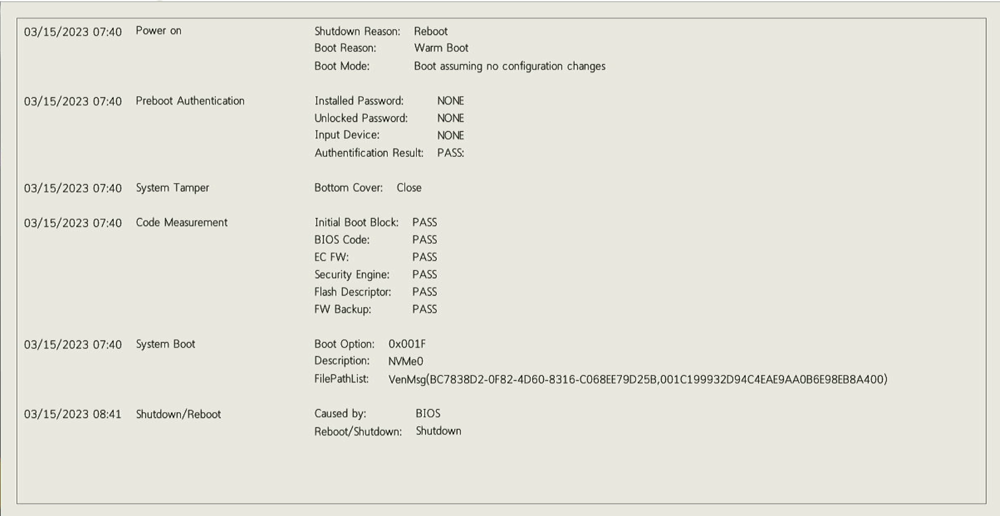

# BIOS Event Logging

This feature logs system and BIOS configuration change events.

## How to view event logs

A log viewer application can be launched from the BIOS Setup Menu.

It allows you to

- show logs
- clear logs

!!! note
    - The clear log process will be run after setup exit.
	- The clear operation is protected by SVP.

- [Main (ThinkPad )](https://cdrt.github.io/mk_docs/ref/bios/settings/thinkpad/main/)
- [Main (ThinkCentre)](https://cdrt.github.io/mk_docs/ref/bios/settings/thinkcentre/main)
- [Main (ThinkStation)](https://cdrt.github.io/mk_docs/ref/bios/settings/thinkstation/main.md)

## Details of event logs

The number of slots (16 or 64) varies between events.

Each event has a header with event metadata.

The following events are logged:

- Power On Event
- Subcomponent Measurement Event
- BIOS Password Change Event
- Subcomponent Self-healing Event
- BIOS Setup Configuration Change Event
- Device Change Event
- System Boot Event
- System Preboot Authentication Event
- System Tamper Event
- POST Error Event
- Flash Update Event
- Set On-Premise Event
- Capsule Update Event
- Log Cleared Event
- Shutdown/Reboot Event

The details provided for each event may vary.  An example is shown below:

