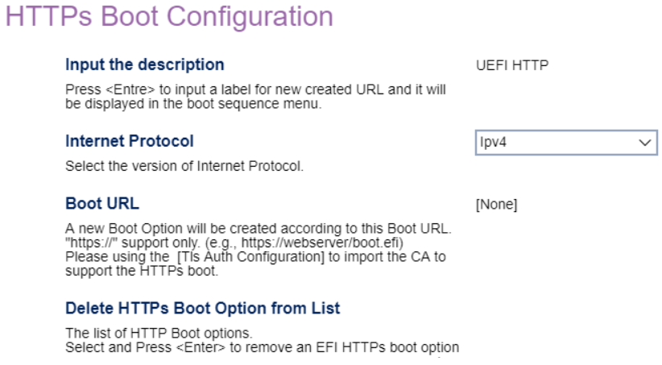

# Network Setup #

Onboard Ethernet Controller

Options:

1.  **Enabled** - Default.
2.  Disabled.

!!! info ""
    Setting to `Disabled` also disables all [Intel (R) AMT](https://software.intel.com/sites/manageability/AMT_Implementation_and_Reference_Guide/default.htm) related functions.

| WMI Setting name | Values | Locked by SVP |
|:---|:---|:---|
| OnboardEthernetController | Disabled, Enabled | yes |

Wireless LAN Access

Controls access to WiFi.

Options:

1.  **Enabled** - Default.
2.  Disabled.

| WMI Setting name | Values | Locked by SVP |
|:---|:---|:---|
| WirelessLANAccess | Disabled, Enabled | yes |

Wireless LAN PXE boot

Whether to load Wireless LAN UNDI Driver to support wireless LAN PXE boot or HTTPS boot.

Options:

1.  **Disabled** - Default.
2.  Enabled.

| WMI Setting name | Values | Locked by SVP |
|:---|:---|:---|
| WirelessLANPXE | Disabled, Enabled | yes |

Wireless Auto Disconnection

Disable wireless LAN when onboard Ethernet is connected.

1.  **Disabled** - Default.
2.  Enable.

| WMI Setting name | Values | Locked by SVP |
|:---|:---|:---|
| WirelessAutoDisconnection | Disabled, Enabled | yes |

### Wireless Certified Information (display only) ###
<!-- SIMULATOR DOES NOT SUPPORT -->

PXE IPV4 Network Stack

Options:

1. **Disabled** - Default.
2. Enabled.

| WMI Setting name | Values | Locked by SVP |
|:---|:---|:---|
| PXEIPV4NetworkStack | Disabled, Enabled | yes |

PXE IPV6 Network Stack

Options:

1.  **Disabled** - Default.
2.  Enabled.

| WMI Setting name | Values | Locked by SVP |
|:---|:---|:---|
| PXEIPV6NetworkStack | Disabled, Enabled | yes |

HTTPS Support

IPV4 and IPV6 boot support.

Options:

2.  **Disabled** - Default.
1.  Enabled.

<!-- NO WMI -->

HTTPS Boot

Custom HTTPS boot.

Options:

1.  **Disabled** - Default.
2.  Enabled.

!!! info ""
    If enabled, `HTTPs Boot Configuration` and `Tls Auth Configuration` will be shown.

<!-- NO WMI -->

Lenovo Cloud Services

Whether `Lenovo Cloud` will be selected in boot menu, to boot from Lenovo Cloud server directly.

1.  **Disabled** - Default.
2. Enabled.

<!-- NO WMI -->

Win VDI Boot

When enabled, `Win VDI Boot` will be selected in boot menu, to boot from Lenovo Cloud server and load VDI service.

Options:

1. **Disabled** - Default.
2. Enabled.

<!-- NO WMI -->

## HTTPs Boot Configuration  ##

Create a new boot option based on a HTTPS URL.

!!! info ""
    Only one configuration can be entered at a time. The configuration will take effect after a system reboot.

Input the description

!!! info ""
    Press `Enter` to input a label for the newly created URL and it will be displayed in the boot sequence menu.

<!-- NO WMI -->

Internet Protocol

Options:

1.  **Ipv4** - enables IPV4. Default.
2.  Ipv6 - enables IPV6.

<!-- NO WMI -->

Boot URL

!!! info ""
    Use the `TLS Auth configuration` to import the CA to support the HTTPs boot 

<!-- NO WMI -->

### Delete HTTPs Boot Option from List ###

!!! info ""
    Select and press `Enter` to remove an EFI HTTPs boot option.

<!-- NO WMI -->

## TLS Auth Configuration ##

Server CA configuration (display only).

!!! info ""
    Press `Enter` to select TLS auto configuration for HTTPS boot.

## WiFi Configuration ##

Automatic Connection Support

Automatically connect to WiFi on boot.

Options:

1. **Disabled** - Default.
2. Enabled.

<!-- NO WMI -->

Current Connection (display only) 

Displays the current WiFi connection.

Wi-Fi Scan 

!!! info ""
    Press `Enter` to scan the available connections.

Scanned List (display only) 

Scanned WiFi nodes.

