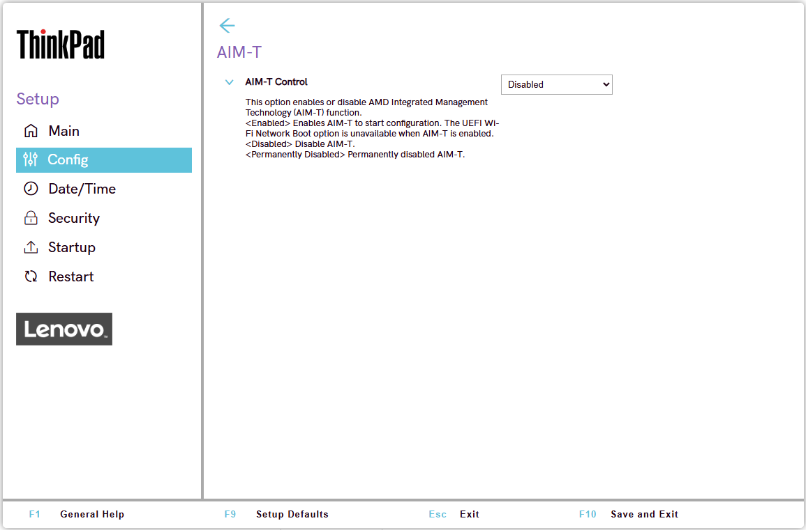

# AIM-T Settings

AIM-T (AMD Integrated Manageability Technology) is AMD's out-of-band manageability solution for AMD PRO platforms, providing secure remote management over a supported wireless (WLAN) connection. It is the wireless counterpart to [AMD DASH](https://docs.lenovocdrt.com/ref/bios/settings/thinkpad/dash/), which covers wired (Ethernet) manageability.

AIM-T Control
:  Whether to enable AIM-T.

    Possible options:

    1. Enabled
    2. **Disabled** – Default.
    3. Permanently Disabled

    !!! note ""
        If SVP is enabled and setup is entered without SVP, this option is grayed out and displays the message "This option requires a supervisor password to unlock."

    | WMI Setting name | Values | Locked by SVP | AMD/Intel |
    |:---|:---|:---|:---|
    | AIMTControl | Disable, Enable, Permanently Disabled | Yes | AMD |
