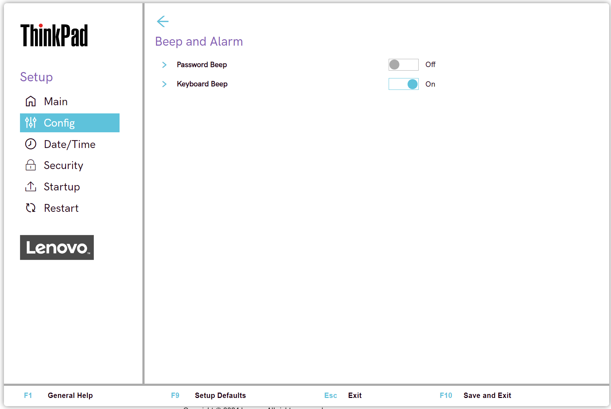

# Beep and Alarm Settings #

Password Beep

Whether to beep when the system is waiting for a power-on, hard disk, or supervisor password.

1.	**Off** - Default.
2.	On

!!! info ""
     Different beeps will be sounded when the entered password matches or does not match the configured password.

| WMI Setting name | Values | Locked by SVP | AMD/Intel |
|:---|:---|:---|:---|
| PasswordBeep | Disable, Enable | Yes | Both |

Keyboard Beep

Whether to beep when unmanageable key combination is pressed. 

1.	**On** - Default.
2.	Off

| WMI Setting name | Values | Locked by SVP | AMD/Intel |
|:---|:---|:---|:---|
| KeyboardBeep | Disable, Enable | Yes| Both |

