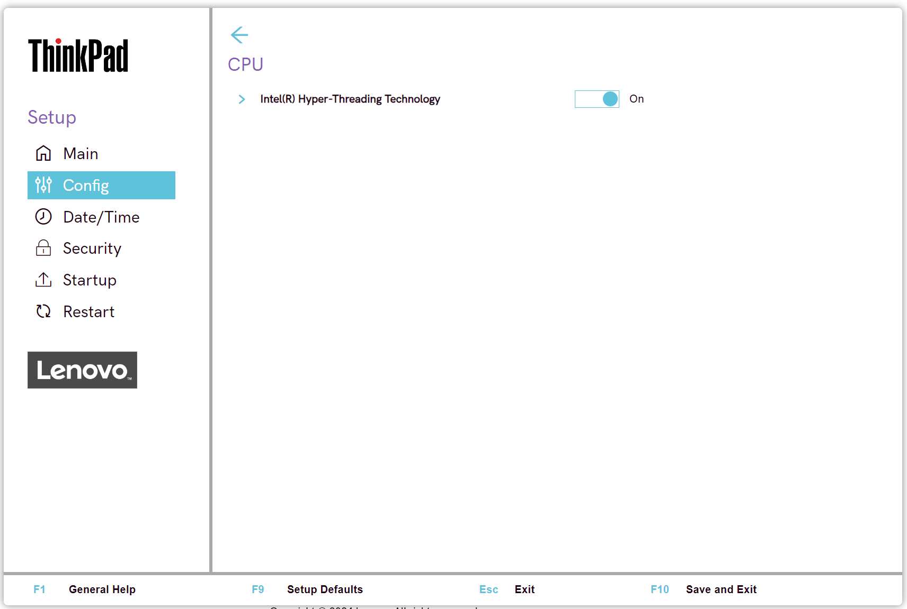

# CPU Settings #

Efficient-cores Support

Whether to enable Efficient-cores support which is available on Intel 12th Generation and later processors.

1. **On** - Default
1. Off

| WMI Setting name | Values | Locked by SVP | AMD/Intel |
|:---|:---|:---|:---|
| EfficientCores | Disable, Enable | No | Intel |

Intel (R) Hyper-Threading Technology

Whether to enable additional CPU threads, which appear as additional processors but share some resources with the other threads within a CPU. 

!!! info ""
    When disable, allows only one thread within each execution core unit.

1.	**On** - Default.
2.	Off

| WMI Setting name | Values | Locked by SVP | AMD/Intel |
|:---|:---|:---|:---|
| HyperThreadingTechnology | Disable, Enable | No | Intel |

