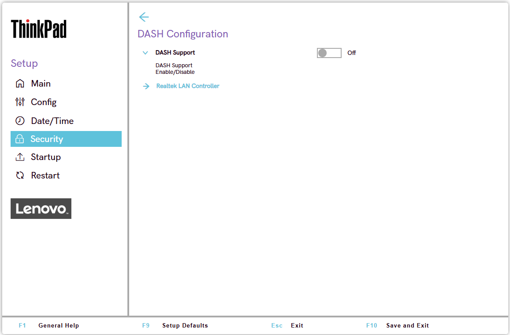

# DASH Configuration

DASH (Desktop and mobile Architecture for System Hardware) is a DMTF standard for out-of-band, wired remote management of AMD PRO platforms via the Ethernet LAN controller. It is the wired counterpart to [AIM-T](https://docs.lenovocdrt.com/ref/bios/settings/thinkpad/aimt/), which covers wireless manageability.

Learn more here: [AMD DASH](https://docs.lenovocdrt.com/ref/dash/)

DASH Support
:  Whether to enable DASH.

    Possible options:

    1. **Off** – Default.
    2. On

    | WMI Setting name | Values | Locked by SVP | AMD/Intel |
    |:---|:---|:---|:---|
    | DashEnabled | Disable, Enable | No | AMD |

Realtek LAN Controller
:  View-only information group for the onboard Realtek Ethernet LAN controller used by DASH.

    !!! note ""
        All the settings in this group are not available via WMI.

    !!! note ""
        On L14 Gen7 (Blanc3) / L16 Gen3 (Cook3) platforms, this same view-only group appears under the heading `Realtek Ethernet Controller Configuration` instead of `Realtek LAN Controller`, though the same three sub-groups (Device Information, Driver Information, Patent Information) apply.

    ??? note "Device Information"
        Device Name: name of the Realtek LAN controller device.

    ??? note "Driver Information"

        - Driver Name: name of the loaded driver.
        - Driver Version: version of the loaded driver.
        - Driver Release Date: release date of the loaded driver.
        - PCI Slot: PCI slot occupied by the controller.

    ??? note "Patent Information"
        Displays the patent notice covering the Realtek LAN controller, for example: "This product is covered by one or more of the following patents: US6,570,884, US6,115,776, and US6,327,625."

RealManage Setup
:  Configuration for RealManage, Realtek's DASH management agent.

    !!! note ""
        Only shown if `DASH Support` is `On`.

    Please Input Username
    :  Enter the username used to authenticate with the RealManage management console.