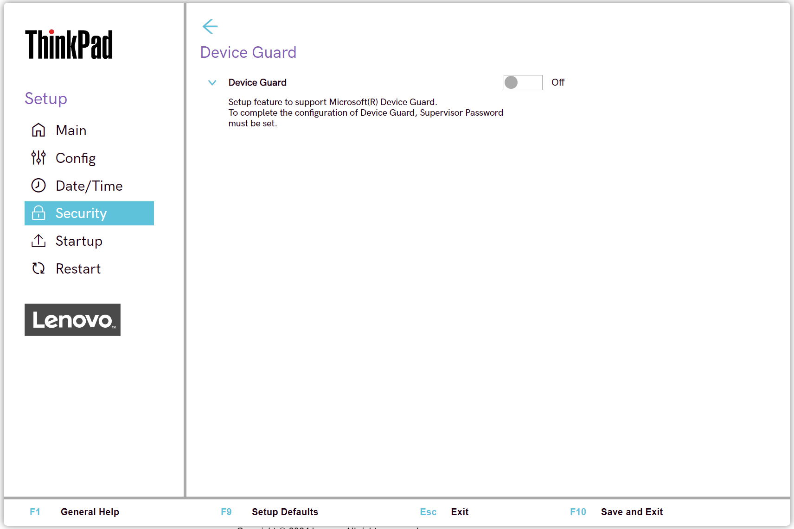

# Device Guard Settings #

Device Guard

Whether to enable Microsoft (R) Device Guard.

!!! info ""
    To configure Device Guard, Supervisor Password must be set.

!!! info ""
    Device Guard is no longer available as a BIOS Setting starting with 2023 products.

Possible options:

1.	**Off** - Default.
2.	On

!!! info ""
     When enabled, Intel Virtualization Technology, Intel VT-d Feature, Secure Boot and OS Optimized Defaults are automatically enabled.

!!! info ""
    Boot Order is restricted to customer image only.

!!! info ""
    This option requires additional confirmation.

| WMI Setting name | Values | Locked by SVP | AMD/Intel |
|:---|:---|:---|:---|
| DeviceGuard | Disable, Enable | Yes | Intel |

