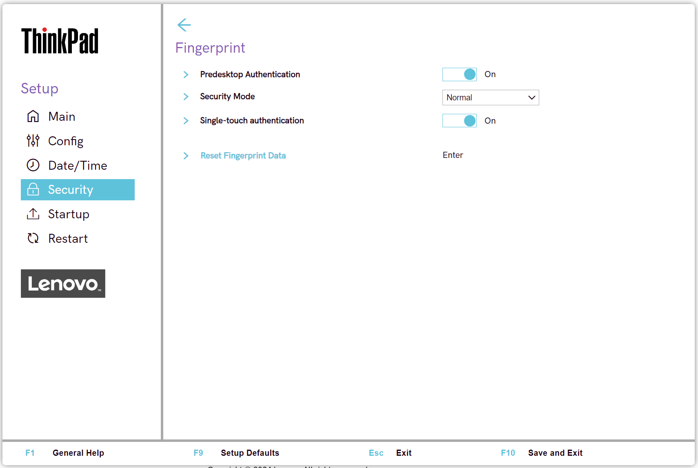

# Fingerprint Settings #

Predesktop Authentication

Whether to enable authentication by a fingerprint at predesktop. 

Possible options:

1.	**On** - Default.
2.	Off

| WMI Setting name | Values | Locked by SVP | AMD/Intel |
|:---|:---|:---|:---|
| FingerprintPredesktopAuthentication | Disable, Enable | Yes | Both |

Security Mode

Whether to require authentication by Power-On Password or Supervisor Password, or only by Supervisor Password, when no fingerprint is authenticated, to boot.

One of 2 possible options:

1.	**Normal** - Default.
2.	High

!!! info ""
    When `High` security mode is enabled, **only** the Supervisor Password will allow boot.

| WMI Setting name | Values | Locked by SVP | AMD/Intel |
|:---|:---|:---|:---|
| FingerprintSecurityMode | Normal, High | Yes | Both |

Password Authentication

Whether to enable authentication by password when fingerprint is not available. 

!!! info ""
    Visible and active only if ‘Security Mode’ has value ‘High’.

Possible options:

1.	**On** - Default.
2.	Off

!!! info ""
     Administrators are authenticated by a Supervisor Password.

| WMI Setting name | Values | Locked by SVP | AMD/Intel |
|:---|:---|:---|:---|
| FingerprintPasswordAuthentication | Disable, Enable | Yes | Both |

Single-touch authentication

Whether to allow a single touch fingerprint authentication to work through all security levels.

!!! info ""
    Switching off means requiring individual fingerprint authentication for each security level.

Options:

1. **On** - Default.
2. Off.

| WMI Setting name | Values | SVP or SMP Req'd | AMD/Intel |
|:---|:---|:---|:---|
| FingerprintSingleTouchAuthentication | On, Off | yes | both |

Reset Fingerprints Data

!!! info ""
    Erase all fingerprint data stored in the fingerprint reader and reset settings to the factory state (ex. Power-on security, LEDs, etc.).

!!! info ""
    Any power-on security features previously enabled will not be able to work until they are re-enabled in fingerprint software.

!!! info ""
    Option requires additional confirmation.

