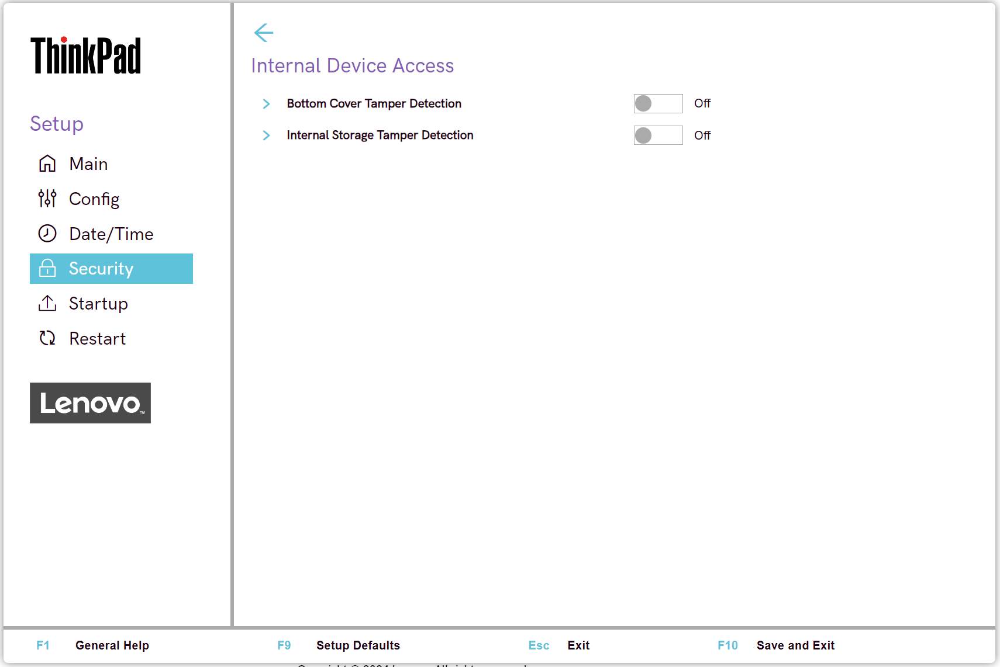

# Internal Device Access Settings #

Bottom Cover Tamper Detection

Whether to enable tamper detection.

!> If tampering is detected, Supervisor Password is required to boot the system.

Possible options:

1.	On
2.	**Off** - Default.

!>  Bottom Cover Tamper Detection will not take effect unless Supervisor Password is enabled.

| WMI Setting name | Values | Locked by SVP | AMD/Intel |
|:---|:---|:---|:---|
| BottomCoverTamperDetected | Disable, Enable | Yes | Both |

Internal Storage Tamper Detection

Whether to detect removal of any fixed or removable Internal storage while the system is in sleep state (S3).

!> If a storage device is removed while the system is in S3 state, the system will shutdown when woken from S3.

!> Unsaved data will be lost.

Possible options:

1.	On
2.	**Off** – Default.

| WMI Setting name | Values | Locked by SVP | AMD/Intel |
|:---|:---|:---|:---|
| InternalStorageTamper | Disable, Enable | Yes | Both |

