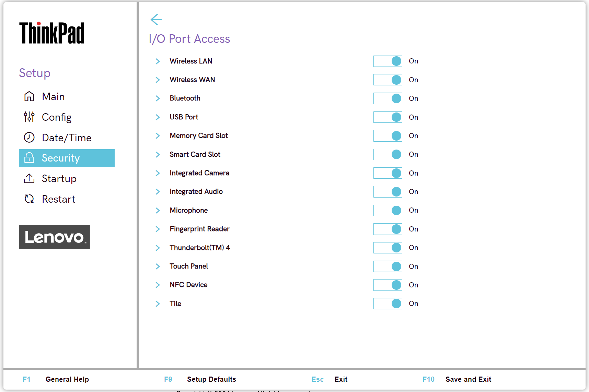

# I/O Port Access Settings #

Ethernet LAN

Select whether to enable or disable Ethernet LAN device and keeps it disabled in the OS environment.

Possible options:

1.	**On** – Default.
2.	Off

!!! info ""
     The setting is removed in the recent versions.

| WMI Setting name | Values | Locked by SVP | AMD/Intel |
|:---|:---|:---|:---|
| EthernetLANAccess | Disable, Enable | Yes | Both |

Wireless LAN

Whether to enable or disable Wireless LAN device and keep it disabled in the OS environment.

Possible options:

1.	**On** - Default.
2.	Off

| WMI Setting name | Values | Locked by SVP | AMD/Intel |
|:---|:---|:---|:---|
| WirelessLANAccess | Disable, Enable | Yes | Both |

Wireless WAN

Select whether to enable or disable Wireless WAN device.

Possible options:

1.	**On** – Default.
2.	Off

| WMI Setting name | Values | Locked by SVP | AMD/Intel |
|:---|:---|:---|:---|
| WirelessWANAccess | Disable, Enable | Yes | Both |

Bluetooth

Possible options:

1.	**On** – Default.
2.	Off

!!! info ""
     Enabling Bluetooth requires setting ‘Wireless LAN’ to ‘Enabled’ state.

| WMI Setting name | Values | Locked by SVP | AMD/Intel |
|:---|:---|:---|:---|
| BluetoothAccess | Disable, Enable | Yes | Both |

USB Port

Whether to enable all USB ports in the OS environment.

!!! info ""
     This setting does not affect USB-C (R) ports with a thunderbolt icon.

Possible options:

1.	**On** – Default.
2.	Off

| WMI Setting name | Values | Locked by SVP | AMD/Intel |
|:---|:---|:---|:---|
| USBPortAccess | Disable, Enable | Yes | Both |

Memory Card Slot

Whether to enable memory card slot (SD Card/MultimediaCard/Memory Stick) in the OS environment.

Possible options:

1.	**On** – Default.
2.	Off

| WMI Setting name | Values | Locked by SVP | AMD/Intel |
|:---|:---|:---|:---|
| MemoryCardSlotAccess | Disable, Enable | Yes | Both |

Smart Card Slot

Whether to enable Smart Card slot in the OS environment.

Possible options:

1.	**On** – Default.
2.	Off

| WMI Setting name | Values | Locked by SVP | AMD/Intel |
|:---|:---|:---|:---|
| SmartCardSlotAccess | Disable, Enable | Yes | Both |

RFID

Whether to enable RFID (radio-frequency identification) in the OS environment.

Possible options:

1.	**On** – Default.
2.	Off

!!! info ""
    This feature is supported only for the [healthcare model](https://techtoday.lenovo.com/jp/ja/solutions/media/3970), where RFID is installed instead of Smart Card. Therefore, parameter for WMI command will be the same as for Smart Card.

| WMI Setting name | Values | Locked by SVP | AMD/Intel |
|:---|:---|:---|:---|
| SmartCardSlotAccess | Disable, Enable | Yes | Both |

Integrated Camera

Whether to enable or disable Integrated Camera in the OS environment.

Possible options:

1.	**On** – Default.
2.	Off

| WMI Setting name | Values | Locked by SVP | AMD/Intel |
|:---|:---|:---|:---|
| IntegratedCameraAccess | Disable, Enable | Yes | Both |

Integrated Audio

Whether to enable all audio functions (Microphone/Speaker) in the OS environment.

!!! info ""
    To enable audio functions, select `Enabled` and save the setting. Then fully shut down and power on the system.

Possible options:

1.	**On** – Default.
2.	Off

| WMI Setting name | Values | Locked by SVP | AMD/Intel |
|:---|:---|:---|:---|
| IntegratedAudioAccess | Disable, Enable | Yes | Both |

Microphone

Select whether to enable or disable Microphone (Internal/External/Line-In) in the OS environment.

!!! info ""
     To enable Microphone, select ‘Enabled’ save the setting. Then fully shut down and power on the system.

Possible options:

1.	**On** – Default.
2.	Off

| WMI Setting name | Values | Locked by SVP | AMD/Intel |
|:---|:---|:---|:---|
| MicrophoneAccess | Disable, Enable | Yes | Both |

Fingerprint Reader

Whether to enable Fingerprint Reader in the OS environment.

Possible options:

1.	**On** – Default.
2.	Off

| WMI Setting name | Values | Locked by SVP | AMD/Intel |
|:---|:---|:---|:---|
| FingerprintReaderAccess | Disable, Enable | Yes | Both |

Thunderbolt (TM) 4

Select whether to enable or disable Thunderbolt 4 (PCIe/USB) in the OS environment.

!!! info ""
     Affects only USB-C ports with a thunderbolt icon.

One of 2 Possible options:

1.	**On** – Default.
2.	Off

| WMI Setting name | Values | Locked by SVP | AMD/Intel |
|:---|:---|:---|:---|
| ThunderboltAccess | Disable, Enable | Yes | Both |

NFC Device

Whether to enable or disable NFC (near-field communication) Device in the OS environment

Possible options:

1.	**On** – Default.
2.	Off

| WMI Setting name | Values | Locked by SVP | AMD/Intel |
|:---|:---|:---|:---|
| NfcAccess | Disable, Enable | Yes | Both |

Tile

Whether to enable Tile Mode in the OS environment.

Options:

1. **On** - Default.
2. Off.

| WMI Setting name | Values | SVP or SMP Req'd | AMD/Intel |
|:---|:---|:---|:---|
| TileMode | Disable,Enable | Yes | both |

