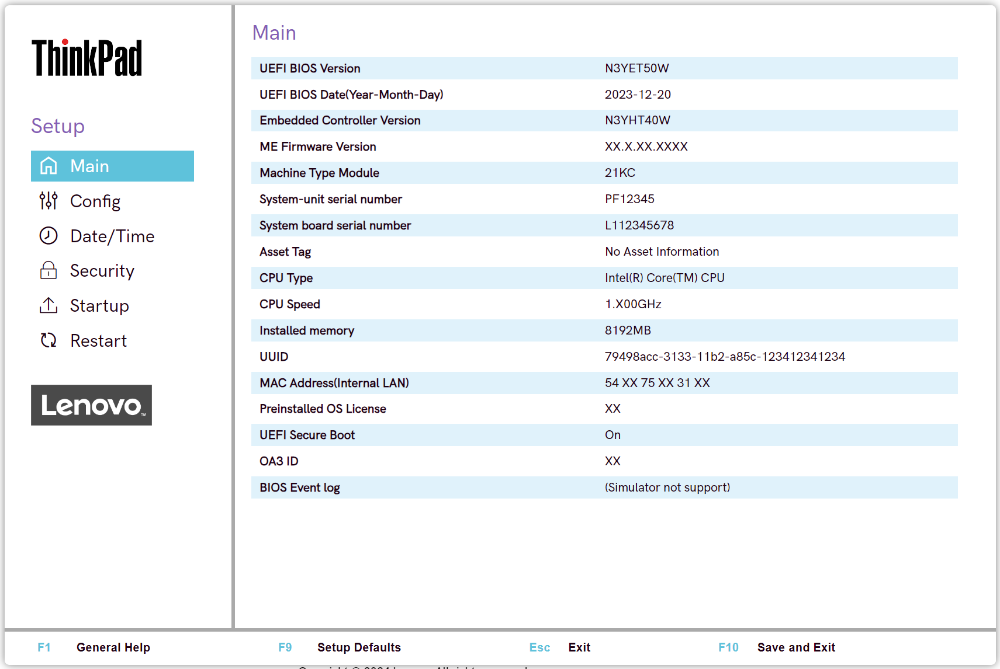

# Main #

The Main display shows (view-only) system information.

It also gives access to the [BIOS Event Log feature](/bios/settings/bios_logging).

BIOS Event Log

The BIOS Event Log tracks BIOS configuration and boot events. These provide insight into the health of a device.

