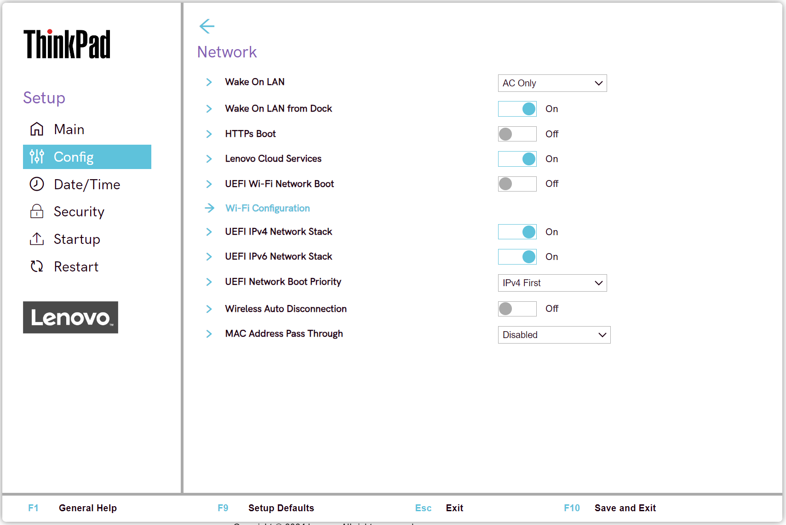
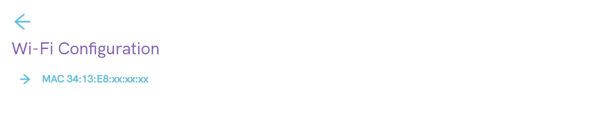
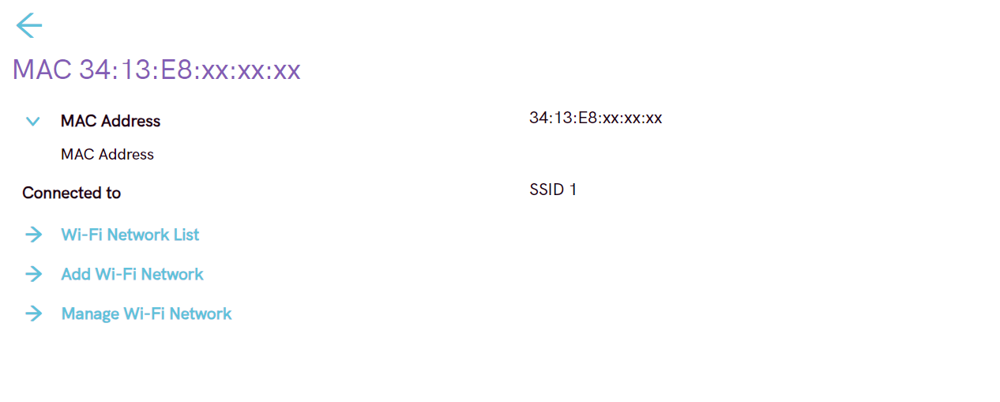
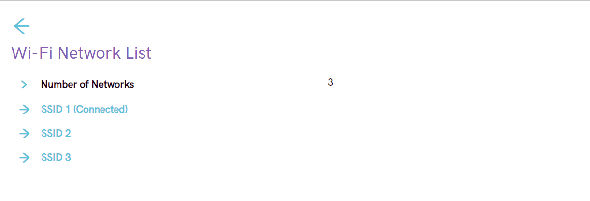
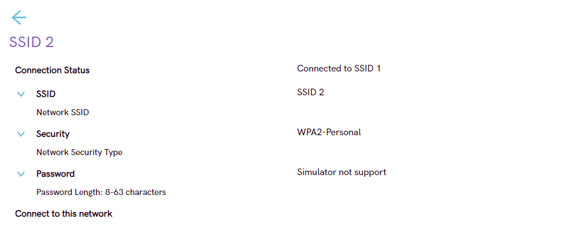
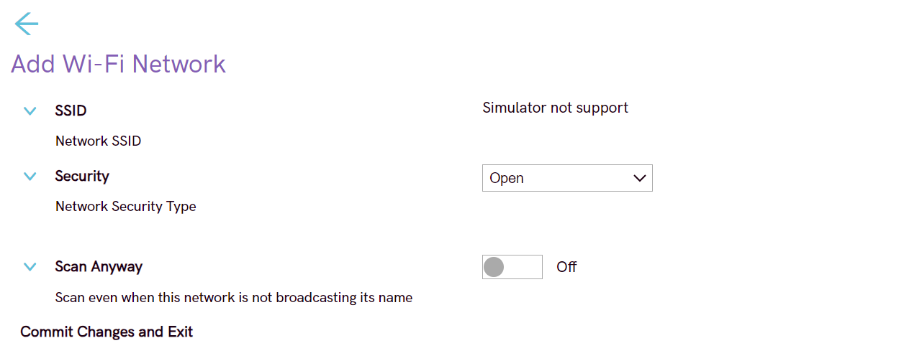
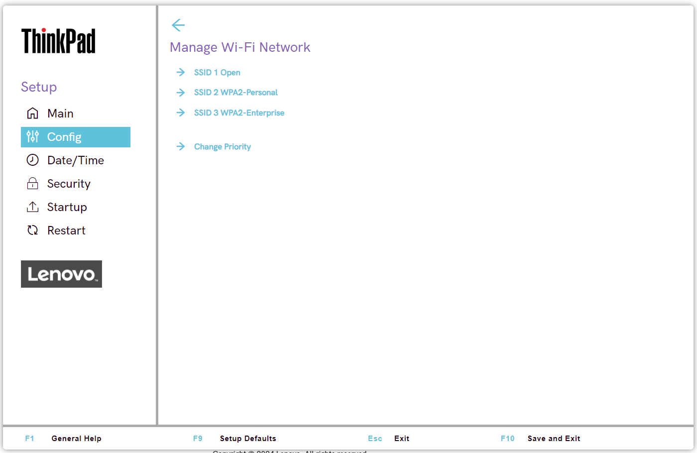
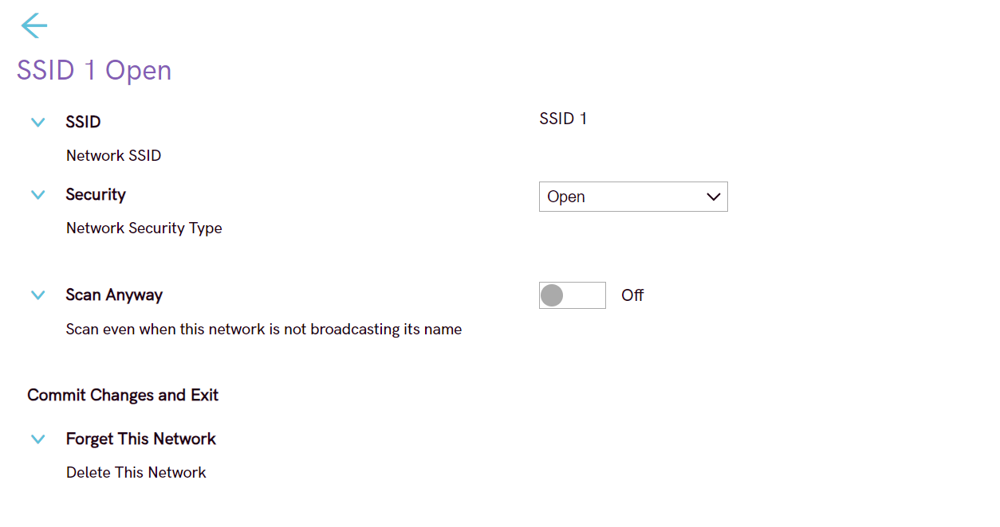

# Network Settings #

### General ###

Wake On Lan

Whether Wake On LAN function works only when AC is attached, or also when with battery power.

!!! info ""
    Only for ThinkPads with built-in Ethernet port.

Possible options:  

1.	**AC Only** - Default.
2.	Disabled
3.	AC and Battery

!!! info ""
    AC is required with magic packet type Wake On LAN.

!!! info ""
    Wake On LAN function may be blocked due to password configuration.

| WMI Setting name | Values | Locked by SVP | AMD/Intel |
|:---|:---|:---|:---|
| WakeOnLAN | Disable, ACOnly, ACandBattery, Enable | No | Both |

Wake On LAN from Dock

!!! info ""
    Only for ThinkPads with no Ethernet port.

!!! info ""
     Will not work while Secure Boot is disabled.

Possible options:

1.	**On** - Default.
2.	Off

!!! info ""
    Works only when ThinkPad USB-C Dock or ThinkPad Thunderbolt Dock is attached.

!!! info ""
    May be blocked due to password configuration.

| WMI Setting name | Values | Locked by SVP | AMD/Intel |
|:---|:---|:---|:---|
| WakeOnLANDock  | Disable, Enable | No | Both |

Lenovo Cloud Services

!!! info ""
    System connects Lenovo Cloud Services via HTTPs. DHCP option settings are not required.

!!! info ""
    This feature will not work while Secure Boot is disabled.

Possible options:

1.	**On** - Default.
2.	Off

**Lenovo Cloud Services Features**

Once this feature is switched `On`, it becomes available for selection in BIOS: [Startup](https://docs.lenovocdrt.com/#/bios/settings/thinkpad/startup), at either `Edit Boot Order`, or `Network Boot`, or via F12 Boot Menu.

Lenovo Cloud Services enables these additional options:

1. **Lenovo Cloud Deploy (ITC)** – sends Factory-Style images to customers for deployment in the field. More information: [Lenovo Cloud Deploy](https://www.lenovoclouddeploy.com/en/auth/welcome)
2. **Windows Virtual Desktop (VDI)** – provides VDI environment to customer. VDI itself will be setup by the customer (IT Admin). If this option is selected, then it will become available as a boot option.  
More information:   - [Client Virtualization & Infrastructure Solutions - Lenovo](https://www.lenovo.com/lt/lt/data-center/solutions/client-virtualization)   - [Windows Virtual Desktop](https://www.microsoft.com/en-us/microsoft-365/blog/2019/09/30/windows-virtual-desktop-generally-available-worldwide/).

| WMI Setting name | Values | Locked by SVP | AMD/Intel |
|:---|:---|:---|:---|
| LenovoCloudServices  | Disable, Enable | No | Intel |

UEFI WI-FI Network Boot

Wether to load UEFI Wi-Fi driver at next boot, able to connect to Access point.

Possible options: 

1. On
2. **Off** - Default.

!!! info ""
    Secure Boot must be enabled to use UEFI Network Boot.

| WMI Setting name | Values | Locked by SVP | AMD/Intel |
|:---|:---|:---|:---|
| WiFiNetworkBoot  | Disable, Enable | No | Intel |

UEFI IPv4 Network Stack

Whether to enable UEFI IPv4 Network Stack for UEFI environment.

Possible options: 

1. **On** - Default.
2. Off

| WMI Setting name | Values | Locked by SVP | AMD/Intel |
|:---|:---|:---|:---|
| IPv4NetworkStack  | Disable, Enable | No | Both |

UEFI IPv6 Network Stack

Whether to enable UEFI IPv6 Network Stack for UEFI environment.

Possible options: 

1. **On** - Default.
2. Off

| WMI Setting name | Values | Locked by SVP | AMD/Intel |
|:---|:---|:---|:---|
| IPv6NetworkStack  | Disable, Enable | No | Both |

UEFI Network Boot Priority

Select Network Stack priority for UEFI PXE Boot.

Possible options:

1. **IPv4 First** – Default.
2. IPv6 First

| WMI Setting name | Values | Locked by SVP | AMD/Intel |
|:---|:---|:---|:---|
| UefiPxeBootPriority  | IPv6First, IPv4First | No | Both |

Wireless Auto Disconnection

Whether to Auto Disconnect Wireless feature when Ethernet cable is connected to Ethernet LAN.

Possible states:

1. On
2. **Off** - Default.

| WMI Setting name | Values | Locked by SVP | AMD/Intel |
|:---|:---|:---|:---|
| WirelessAutoDisconnection  | Disable, Enable | No | Both |

MAC Address Pass Through

Whether to enable MAC Address Pass Through when dock is attached.

Possible options:

1. **Disabled** - Dock Ethernet uses its own MAC address. Default
2. Internal MAC Address - Dock Ethernet uses same MAC address as internal LAN.
3. Second MAC Address - Dock Ethernet uses the second MAC address that is stored in the system's EEPROM. This allows for a device-specific MAC address that is different from the internal NIC's MAC address so they can be managed separately if necessary.

!!! info ""
    For systems that do not have an internal NIC, the options are:   **off** - the dock will use it's own MAC Address   **on** - dock will use MAC address stored in the system EEPROM.

| WMI Setting name | Values | Locked by SVP | AMD/Intel |
|:---|:---|:---|:---|
| MACAddressPassThrough  | Disable, Enable, Second | No | Both |

Reinstall Windows from Cloud

Enable/Disable “Reinstall Windows from Cloud (Microsoft® Connected System Recovery)” in the App Menu invoked by F12.
Choosing Reinstall Windows from Cloud from the F12 menu will completely replace the system software, including all user files, and cannot be undone.This feature works with system-integrated Ethernet LAN or wireless LAN (only WPA2 personal). Secure Boot must be enabled to use Reinstall Windows from Cloud.
Please note that this feature is not compatible with Lenovo Cloud Boot. Do not attempt to start Lenovo Cloud Boot while Reinstall Windows from Cloud is enabled.

Possible options:

1. **Disabled** - Default.
2. Enable.

### WiFi Configuration ###

!!! info ""
    All the settings in this group are not available via WMI.

MAC Address

Media access control (MAC) address of the wireless network interface controller.

!!! info ""
    View only.

!!! info ""
    There could be several MAC addresses for machines that have several wireless network interface controllers (NICs).

For every MAC Address the following information is shown:

* MAC Address - Media access control (MAC) address of the selected wireless network interface controller.

!!! info ""
    View only.

Possible options:

   1. **Disconnected** - Default.
   2. Connected to [SSID]

!!! info ""
    Option `Connected to [SSID]` displays the ID of the wireless network.

 

### Wi-Fi Network List ###

!!! info ""
     All the settings in this group are not available via WMI.

**Number of networks:** Number of current available networks.

!!! info ""
    View only.

For each network the Security Type is shown.

* Possible values are "Open" and "Secured".
* If Secured, the security type is displayed.

!!! info ""
    View only.

Each SSID can be selected to display more details.

[SSID Value](Status)

Connection Status

Whether device is connected to this Wi-Fi network.

!!! info ""
    View only.

Possible statuses:

1.	**Disconnected** - Default.
2.	Connected

SSID

SSID (Service Set Identifier) is the name of the wireless network.

!!! info ""
    View only.

Security

Security type of this Wi-Fi network.

!!! info ""
    View only.

Possible options:

1.	Open
2.	WPA2-Personal
3.	**WPA2-Enterprise** - Default.
4. PEAP
5. EAP-TLS

Password

Enter password.

!!! info ""
    Visible only for networks with security WPA2-Personal.

!!! info ""
    Password length: 8-63 characters.

EAP Authentication Method

Select EAP Authentication Method.

Possible options:

1. PEAP
2.	EAP-TLS

EAP Second Authentication Method

Select EAP Second Authentication Method.

Possible options:

1. MSCHAPv2

Enroll CA Cert

Enroll CA (Certification Authority) certificate.

Empty by default.

!!! info ""
    Visible only for networks with security WPA2-Enterprise.

Enroll Client Cert

Enroll client certificate.

Empty by default.

!!! info ""
    Visible only for networks with security WPA2-Enterprise and if `EAP Authentication Method` is `EAP-TLS`.

Enroll Client Private Key

Enroll client private key.

Empty by default.

!!! info ""
    Visible only for networks with security WPA2-Enterprise and if `EAP Authentication Method` is `EAP-TLS`.

Identity

Identity value if there is any.

View only.

!!! info ""
    Identity length: 6-20 characters.

!!! info ""
    Visible only for networks with security WPA2-Enterprise.

EAP Password

Field for entering EAP password.

!!! info ""
    Password length: 1-63 characters.

!!! info ""
    Visible only for networks with security WPA2-Enterprise.

[Action]

Possible actions:

1.	Connect to this network - visible if device is not connected to this Wi-Fi network
2.	Disconnect - visible if device is connected to this Wi-Fi network

 

### Add Wi-Fi Network ###

!!! info ""
     All the settings in this group are not available via WMI.

SSID

Field for entering SSID value.

Security

Select the security type of this Wi-Fi network.

Possible options:

1.	**Open** – Default
2.	WPA2 – Personal
3.	WPA2 – Enterprise

Password

Enter password.

!!! info ""
    Visible only for a network with security WPA2-Personal.

!!! info ""
    Password length: 8-63 characters.

EAP Authentication Method

!!! info ""
    Visible only for a network with security WPA2-Enterprise.

Possible options:

1.	**PEAP** – Default
2.	EAP-TLS

EAP Second Authentication Method

!!! info ""
    Visible only for a network with security WPA2-Enterprise and if `EAP Authentication Method` is `PEAP`.

Possible options:

1.	**MSCHAPv2** – Default.

Enroll CA Cert

Enroll CA (Certification Authority) certificate.

Empty by default.

!!! info ""
    Visible only for networks with security WPA2-Enterprise.

Enroll Client Cert

Enroll client certificate.

Empty by default.

!!! info ""
    Visible only for networks with security WPA2-Enterprise and if `EAP Authentication Method` is `EAP-TLS`.

Enroll Client Private Key

Enroll client private key.

Empty by default.

!!! info ""
    Visible only for networks with security WPA2-Enterprise and if `EAP Authentication Method` is `EAP-TLS`.

Identity

Enter identity value (if there is any).

!!! info ""
    Identity length: 6-20 characters.

!!! info ""
    Visible only for a network with security WPA2-Enterprise.

EAP Password

Field for entering EAP password.

!!! info ""
    Password length: 1-63 characters.

!!! info ""
    Visible only for a network with security WPA2-Enterprise.

Scan Anyway

Possible options:

1.	**On** - the network will be scanned when it does not broadcast its name. Default.
2.	Off - the network will not be scanned when it does not broadcast its name.

Visible only for a network with security WPA2-Enterprise.

Commit Changes and Exit

This is the option to save changes and exits back to the Manage Wi-Fi network page.

### Manage Wi-Fi Network ###

!!! info ""
     All the settings in this group are not available via WMI.

!!! info ""
    Each listed network is represented by a `[SSID Value][Type]` and has its own sub-group of settings - open the items below for details.

[SSID Value][Type] 

SSID value and its type.

Every SSID on the list leads to details for this network.

See descriptions below.

SSID

Field for editing SSID value.

Security

Select the security type of this Wi-Fi network.

!!! info ""
    Default value depends on the network.

Possible options:

1.	Open
2.	WPA2-Personal
3.	WPA2-Enterprise

Password

Enter password.

!!! info ""
    Visible only for a network with security WPA2-Personal.

!!! info ""
    Password length: 8-63 characters.

EAP Authentication Method

Select EAP Authentication Method.

Possible options:

1.	**PEAP** – Default
2.	EAP-TLS

Visible only for a network with security WPA2-Enterprise.

EAP Second Authentication Method

Select Second EAP Authentication Method.

Possible options:

1.	**MSCHAPv2** – Default.

!!! info ""
    Visible only for a network with security WPA2-Enterprise and if `EAP Authentication Method` is `PEAP`.

Enroll CA Cert

Enroll CA (Certification Authority) certificate.

Empty by default.

!!! info ""
    Visible only for networks with security WPA2-Enterprise.

Enroll Client Cert

Enroll client certificate.

Empty by default.

!!! info ""
    Visible only for networks with security WPA2-Enterprise and if `EAP Authentication Method` is `EAP-TLS`.

Enroll Client Private Key

Enroll client private key.

Empty by default.

!!! info ""
    Visible only for networks with security WPA2-Enterprise and if `EAP Authentication Method` is `EAP-TLS`.

Identity

Enter identity value (if there is any).

!!! info ""
    Identity length: 6-20 characters. 

!!! info ""
    Visible only for a network with security WPA2-Enterprise.

EAP Password

Enter EAP password.

!!! info ""
    Password length: 1-63 characters.

!!! info ""
    Visible only for a network with security WPA2-Enterprise.

Scan Anyway

Whether the network will be scanned anyway, even if it does not broadcast its name.

Possible options:

1.	On
2.	**Off** - Default.

!!! info ""
    Visible only for a network with security WPA2-Enterprise.

Commit Changes and Exit

Save changes and exits back to the Manage Wi-Fi network page.

Forget This Network

Forget the settings for the selected network and disconnect from it.

Change Priority

View list of saved Wi-Fi networks.

!!! info ""
    The option will show a warning message if Network List is empty.

See descriptions below.

Priority List

List of SSIDs of the saved networks.

Commit Changes and Exit

Save changes and exits back to the Manage Wi-Fi network page.

