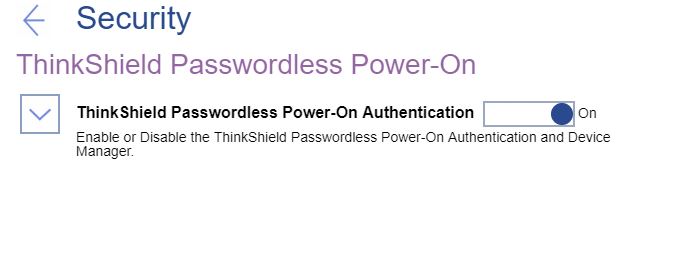

# ThinkShield Passwordless Power-On  #

ThinkShield Passwordless Power-On Authentication

Enable or Disable the ThinkShield Passwordless Power-On Authentication and Device Manager.

Options:

1.  **On** - Default.
2.  Off.

| WMI Setting name | Values | SVP or SMP Req'd | AMD/Intel |
|:---|:---|:---|:---|
| ThinkShieldPasswordlessPowerOnAuthentication | Disable,Enable | yes | both |

