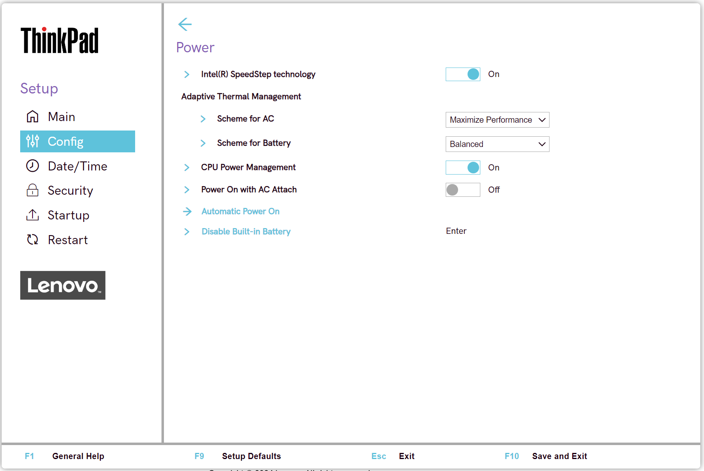
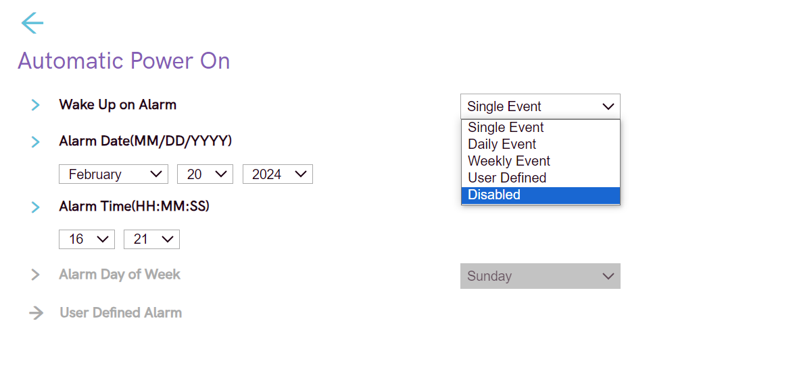
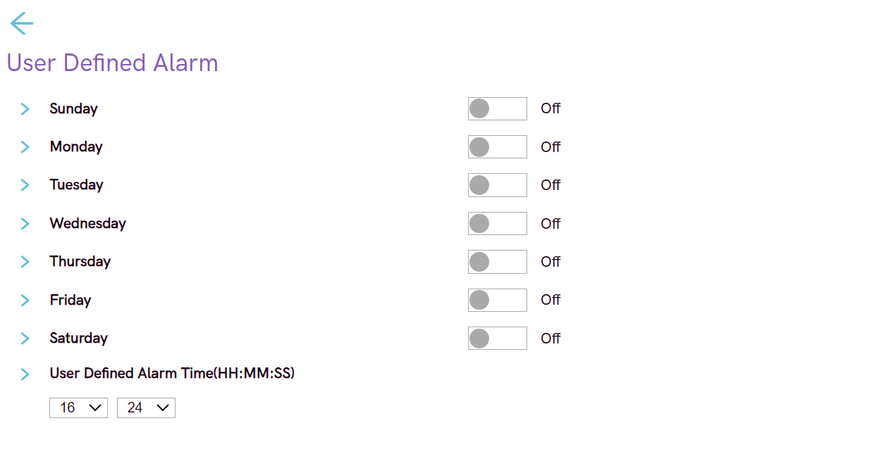

# Power Settings #

### General ###

Intel (R) SpeedStep Technology

Whether to switch on Intel (R) SteedStep Technology at runtime

Possible options:

1.	**On** – Default.
2.	Off

| WMI Setting name | Values | Locked by SVP | AMD/Intel |
   |:---|:---|:---|:---|
| SpeedStep | Disable, Enable | No | Intel |

Scheme for AC

Select thermal management scheme.

Possible options:

1.	**Maximize Performance** - reduces CPU throttling. Default.
2.	Balanced - balanced sound, temperature, and performance.

!!! info ""
     Each scheme affects fan sound, temperature, and performance.

| WMI Setting name | Values | Locked by SVP | AMD/Intel |
   |:---|:---|:---|:---|
| AdaptiveThermalManagementAC | MaximizePerformance, Balanced | No | Both |

Scheme for Battery

Select thermal management scheme.

Possible options:

1.	Maximize Performance - reduces CPU throttling.
2.	**Balanced** - balanced sound, temperature, and performance. Default.

!!! info ""
     Each scheme affects fan sound, temperature, and performance.

| WMI Setting name | Values | Locked by SVP | AMD/Intel |
   |:---|:---|:---|:---|
| AdaptiveThermalManagementBattery | MaximizePerformance,  Balanced | No | Both |

Intelligent Cooling Boost

Whether to  improve power efficiency by limiting system power based on the selected OS application, when Intelligent Cooling is on.

!!! info ""
    This feature is Windows only.

!!! info ""
    For more details about Intelligent Cooling mode, please refer to Vantage or the user guide.

Options:

1.  **On** - Default.
2.  Off.

| WMI Setting name | Values | SVP or SMP Req'd | AMD/Intel |
|:---|:---|:---|:---|
| IntelligentCoolingBoost | Disable,Enable | yes | both |

CPU Power Management

Whether to shut down the microprocessor clock automatically when there are no system activities, for power saving. 

Possible options:

1.	**Automatic** - Default.
2.	Disabled

!!! info ""
     Normally, it is not necessary to change this setting.

| WMI Setting name | Values | Locked by SVP | AMD/Intel |
   |:---|:---|:---|:---|
| CPUPowerManagement | Disable, Automatic | No | Both |

Power On with AC Attach

Whether to power on the system when AC is attached.

!!! info ""
    If the system is in hibernate state, the system resumes upon AC connect.

Possible options:

1.	Enabled
2.	**Disabled** - Default.

| WMI Setting name | Values | Locked by SVP | AMD/Intel |
   |:---|:---|:---|:---|
| OnByAcAttach | Disable, Enable | No | Both |

Sleep State

Optimized Sleep States.

!!! info ""
    Sleep State for Windows® and versions of Linux are compatible with Suspend-to-Idle.

!!! info ""
    Optimized Sleep State for S3 are not compatible with Suspend-to-Idle.

!!! info ""
    Windows® must be used with Windows setting only.

Options:

1.  **Windows and Linux** - Default.
2.  Linux S3

| WMI Setting name | Values | SVP or SMP Req'd | AMD/Intel |
|:---|:---|:---|:---|
| SleepState | Linux, Windows, Windows10 | yes | both |

Disable Built-in Battery

Temporarily disable battery to service the system.

This option requests additional confirmation.

!!! info ""
    After selecting this item, the system will be automatically powered off, ready to be serviced.

!!! info ""
     The battery will be automatically enabled when the AC adapter is reconnected.

### Automatic Power On ###

Wake Up on Alarm

Define when the system will turn on automatically.

Possible options:

1.	**Disabled** - the system will not turn on automatically. Default.
2.	Single Event - the system will turn on one-time on the specified day and time.
3.	Daily Event - the system will turn on every day at the specified time.
4.	Weekly Event - the system will turn on every week on the specified day and time.
5.	User Defined - this option enables ‘User Defined Alarm’ group of settings.

!!! info ""
    Wake up will only occur on AC power.  Values for the `Wake Up on Alarm` group of settings can be overwritten by the operating system.

| WMI Setting name | Values | Locked by SVP | AMD/Intel |
   |:---|:---|:---|:---|
| WakeUponAlarm | Disable, UserDefined, WeeklyEvent,  DailyEvent, SingleEvent | Yes | Both |

Alarm Date (MM/DD/YYYY)

Select the exact day for the system to turn on.

!!! info ""
    Active only when `Wake Up on Alarm` has value `Single Event`.

Possible options:

1.	**N/A** – Default.
2.	MM/DD/YYYY: 
    a. MM – Months: January to December  
    b. DD – Date: 1 ~ 31  
    c. YYYY – Year: 1980 ~ 2099  

| WMI Setting name | Values | Locked by SVP | AMD/Intel |
   |:---|:---|:---|:---|
| AlarmDate | MM/DD/YYYY | Yes | Both |

Alarm Time (HH : MM : SS)

Select the exact time for the system to turn on.

Active when `Wake Up on Alarm` has one of the values:

* `Single Event`
* `Daily Event`
* `Weekly Event`

Possible options:

1.	**N/A** – Default
2.	HH : MM : SS 
    a. HH - Hour:  00 ~ 23 
    b. MM - Minute:  00 ~ 59 
    c. SS - Second:  00 ~ 59 

| WMI Setting name | Values | Locked by SVP | AMD/Intel |
   |:---|:---|:---|:---|
| AlarmTime | HH/MM/SS | Yes | Both |

Alarm Day of Week

Select the exact day for the system to turn on.

Active only when `Wake Up on Alarm` has value `Weekly Event`.

Possible options:

1.	**N/A** – Default
2.	Sunday
3.	Monday
4.	Tuesday
5.	Wednesday
6.	Thursday
7.	Friday
8.	Saturday

| WMI Setting name | Values | Locked by SVP | AMD/Intel |
   |:---|:---|:---|:---|
| AlarmDayofWeek | Sunday, Monday, Tuesday,  Wednesday, Thursday, Friday, Saturday | Yes | Both |

### Automatic Power On - User Defined Alarm ###

Sunday

Whether the system will turn on automatically on this day.

1.	**Off** - Default.
2.	On

| WMI Setting name | Values | Locked by SVP | AMD/Intel |
   |:---|:---|:---|:---|
| UserDefinedAlarmSunday | Disable, Enable | Yes | Both |

Monday

Whether the system will turn on automatically on this day.

1.	**Off** - Default.
2.	On

| WMI Setting name | Values | Locked by SVP | AMD/Intel |
   |:---|:---|:---|:---|
| UserDefinedAlarmMonday | Disable, Enable | Yes | Both |

Tuesday

Whether the system will turn on automatically on this day.

1.	**Off** - Default.
2.	On

| WMI Setting name | Values | Locked by SVP | AMD/Intel |
   |:---|:---|:---|:---|
| UserDefinedAlarmTuesday | Disable, Enable | Yes | Both |

Wednesday

Whether the system will turn on automatically on this day.

1.	**Off** - Default.
2.	On

| WMI Setting name | Values | Locked by SVP | AMD/Intel |
   |:---|:---|:---|:---|
| UserDefinedAlarmWednesday | Disable, Enable | Yes | Both |

Thursday

Whether the system will turn on automatically on this day.

1.	**Off** - Default.
2.	On

| WMI Setting name | Values | Locked by SVP | AMD/Intel |
   |:---|:---|:---|:---|
| UserDefinedAlarmThursday | Disable, Enable | Yes | Both |

Friday

Whether the system will turn on automatically on this day.

1.	**Off** - Default.
2.	On

| WMI Setting name | Values | Locked by SVP | AMD/Intel |
   |:---|:---|:---|:---|
| UserDefinedAlarmFriday | Disable, Enable | Yes | Both |

Saturday

Whether the system will turn on automatically on this day.

1.	**Off** - Default.
2.	On

| WMI Setting name | Values | Locked by SVP | AMD/Intel |
   |:---|:---|:---|:---|
| UserDefinedAlarmSaturday | Disable, Enable | Yes | Both |

User Defined Alarm Time (HH : MM : SS)

Select the exact time for the system to turn on.

Possible options:

1.	**N/A** – Default
2.	HH : MM : SS 
    a. HH - Hour:  00 ~ 23 
    b. MM - Minute:  00 ~ 59 
    c. SS - Second:  00 ~ 59 

| WMI Setting name | Values | Locked by SVP | AMD/Intel |
   |:---|:---|:---|:---|
| UserDefinedAlarmTime | HH/MM/SS | Yes | Both |

