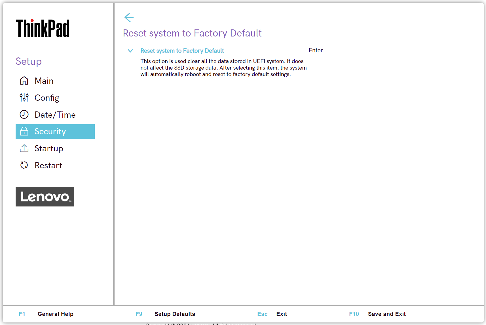

# Reset System to Factory Defaults

This option was introduced in 2023 products and is different than the Load Setup Defaults or Load Factory Defaults option found under Restart.

This option will clear all data stored in the UEFI system.  It does not affect the SSD storage data. After selecting this item the system will automatically reboot and reset to factory default settings. 

!!! info ""
    Some important notes about this feature:  - If a Supervisor Password is set, you will be prompted to enter it before proceeding. The password will be cleared once the system reboots.  - If a set of custom default settings were defined, they will be cleared as well.  - The **Absolute Persistence Module Permanent Disabled** and **Intel AMT Control Permanent Disabled** settings will NOT be reset.  - The process can take several minutes to complete. The screen may be blank for some time and lights on the keyboard may flash.  Please do not interrupt the process.
