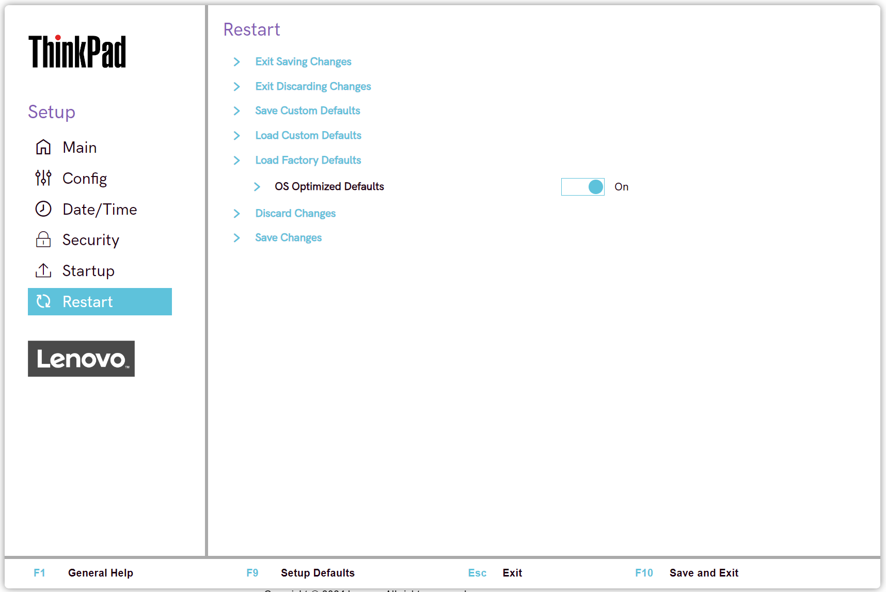

# Restart

Exit Saving Changes

Exit Setup and save your changes.

!!! info ""
    The option requires additional confirmation.

Exit Discarding Changes

Exit Setup without saving changes.

!!! info ""
    The following changes WILL NOT be discarded and must be reset within ThinkPad Setup:   - Date & Time  - Supervisor Password  - Power-on password  - Hard disk password  

!!! info ""
    The option requires additional confirmation.

Save Custom Defaults -and- Load Custom Defaults

This feature was introduced in 2023 products and allows you to create a custom set of default settings that differ from the factory defaults. These custom default settings can be applied to the system again using the Load Custom Defaults option in the UI or by pressing F9. When custom default settings have been saved and F9 is pressed, a dialog will appear with the option to select Factory Defaults or Custom Defaults.

It is important to note that Security, Date & Time, and Boot Order settings are excluded from the custom defaults.

!!! info ""
    If a user performs the Reset System to Factory Defaults function under the Security menu, the custom defaults will be cleared and the system will revert back to the factory default settings.

The following WMI methods are available to exercise this feature and are subject to Supervisor Password or Certificate-based authentication:

- Lenovo_SaveCustomDefaultSettings
- Lenovo_SaveCustomDefaultSettingsEx
- Lenovo_LoadCustomDefaultSettings
- Lenovo_LoadCustomDefaultSettingsEx
- Lenovo_LoadFactoryDefaultSettings

Load Setup Defaults -or- Load Factory Defaults

Load default values for all Setup items. The name shown in BIOS Setup for this feature changed to Load Factory Defaults in 2023 products.

!!! info ""
    The following changes WILL NOT be discarded and must be reset within ThinkPad Setup:   - Security  - Date & Time  

OS Optimized Defaults

Whether to enable OS Optimized Defaults for the following:

- Secure Boot
- Secure RollBack Prevention
- Virtualization features

!!! info ""
    Select ‘On’ to meet Microsoft (R) Windows 10 (R) Certification Requirement.

!!! info ""
    When switching from ‘Enabled’ state the option will require additional confirmation.

Possible options:

1.	**Off** - Default.
2.	On

Discard Changes

Load previous values for most Setup items.

!!! info ""
    The following changes WILL NOT be discarded and must be reset within ThinkPad Setup:   - Date & Time   - Supervisor password   - Power-on password   - Hard disk password   

!!! info ""
    The option requires additional confirmation.

Save Changes

Save Setup data.

