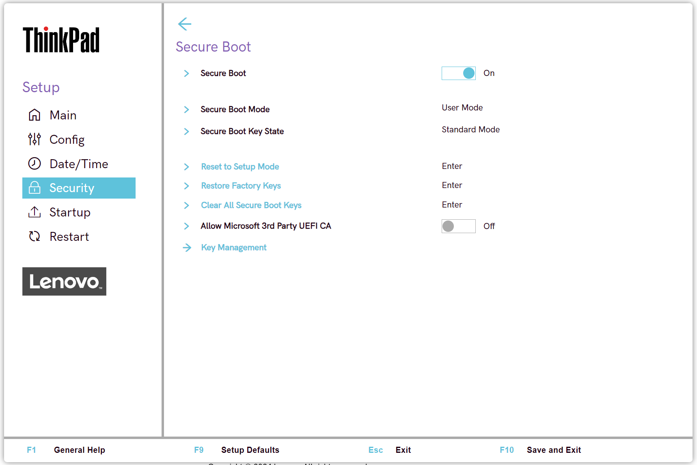
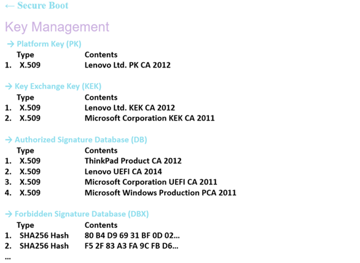

# Secure Boot Settings #

### General ###

Secure Boot

Whether to prevent unauthorized operating systems from running at boot time.

!!! info ""
    Set to `On` if `OS Optimized Defaults` has value `On`.

Possible options:

1.	On
2.	**Off** – Default

| WMI Setting name | Values | Locked by SVP | AMD/Intel |
|:---|:---|:---|:---|
| SecureBoot | Disable, Enable | Yes* | Both |

!!! info ""
     On systems produced after 2020, Secure Boot setting can only be set to Disable using WMI when an SVP is passed.

!!! info ""
    Secure Boot can always be set to Enable without a password.

Secure Boot Mode

Possible modes:

1.	Setup mode
2.	**User mode** - default.

Secure Boot Key State

Possible modes:

1.	Custom mode
2.	**Standard mode** - default.

Reset to Setup Mode

This option is used to clear the current Platform Key and put the system into setup mode.

!!! info ""
    You can install your own Platform Key and customize the Secure Boot signature databases in setup mode.

!!! info ""
    Requires additional confirmation.

!!! info ""
     Secure Boot Mode will be set to Custom Mode.

Restore Factory Keys

Restore all keys and certificates in Secure Boot databases to factory defaults.

!!! info ""
    Any customized Secure Boot settings will be erased.

!!! info ""
    The default Platform key will be re-established along with the original signature databases including certificate for Microsoft (R) Windows 10 (R).

!!! info ""
    Requires additional confirmation.

Clear All Secure Boot Keys

Clear all keys and certificates in Secure Boot databases.

!!! info ""
    You can install your own keys and certificates after selecting this option.

!!! info ""
    Requires additional confirmation.

Allow Microsoft 3rd Party UEFI CA

Whether to allow installation of Microsoft 3rd Party UEFI CA in Secure Boot DB, and trust it in Secure Boot.

!!! info ""
    If add-on cards are supported, Microsoft 3rd Party UEFI CA will not be removed until load boot loader.

Options:

1. **Off** - Default.
2. On.

| WMI Setting name | Values | SVP or SMP Req'd | AMD/Intel |
|:---|:---|:---|:---|
| Allow3rdPartyUEFICA |  Disable, Enable | yes | both |

### Key Management ###

Platform Key (PK)

The platform key establishes a trust relationship between the platform owner and the platform firmware.

The platform owner enrolls the public half of the key into the platform firmware.

The platform owner can later use the private half of the key to change platform ownership or to enroll a Key Exchange Key.

Standard Windows commands are supported:
- [Windows Secure Boot Key Creation and Management Guidance](https://docs.microsoft.com/en-us/windows-hardware/manufacture/desktop/windows-secure-boot-key-creation-and-management-guidance)

Key Exchange Key (KEK)

Key exchange keys establish a trust relationship between the operating system and the platform firmware.

Each operating system (and potentially, each 3rd party application that needs to communicate with platform firmware) enrolls a public key into the platform firmware.

 Standard Windows commands are supported:
 - [Windows Secure Boot Key Creation and Management Guidance](https://docs.microsoft.com/en-us/windows-hardware/manufacture/desktop/windows-secure-boot-key-creation-and-management-guidance)

Authorized Signature Database (DB)

Database keys shows the list of allowed certificates.

System will check digital signatures of bootloaders using public keys in the DB.

Only software or firmware which has a bootloader signed with a corresponding private key will be allowed to run.

 Standard Windows commands are supported:
 - [Windows Secure Boot Key Creation and Management Guidance](https://docs.microsoft.com/en-us/windows-hardware/manufacture/desktop/windows-secure-boot-key-creation-and-management-guidance)

Forbidden Signature Database (DBX)

Forbidden Signature Database shows not allowed certificates.

System will block any software or firmware signed with a corresponding private key.

 Standard Windows commands are supported:
 - [Windows Secure Boot Key Creation and Management Guidance](https://docs.microsoft.com/en-us/windows-hardware/manufacture/desktop/windows-secure-boot-key-creation-and-management-guidance)

