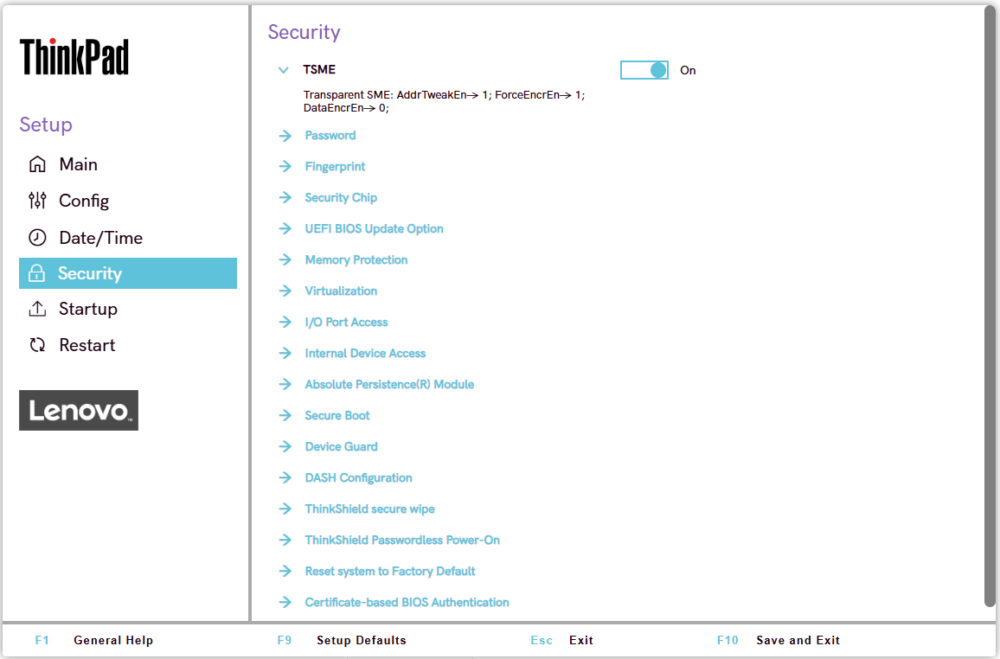

# Security

Transparent Secure Memory Encryption (TSME)
:  AMD's platform-level DRAM encryption feature, protecting memory contents against physical attacks.

    Possible options:

    1. **On** – Default.
    2. Off

    | WMI Setting name | Values | Locked by SVP | AMD/Intel |
    |:---|:---|:---|:---|
    | TSME | Disable, Enable | Yes | AMD |
