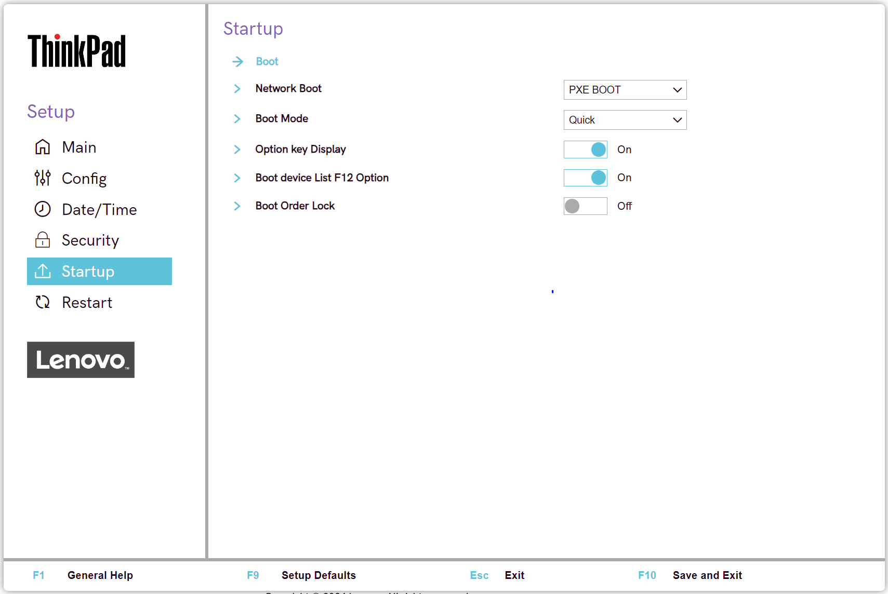
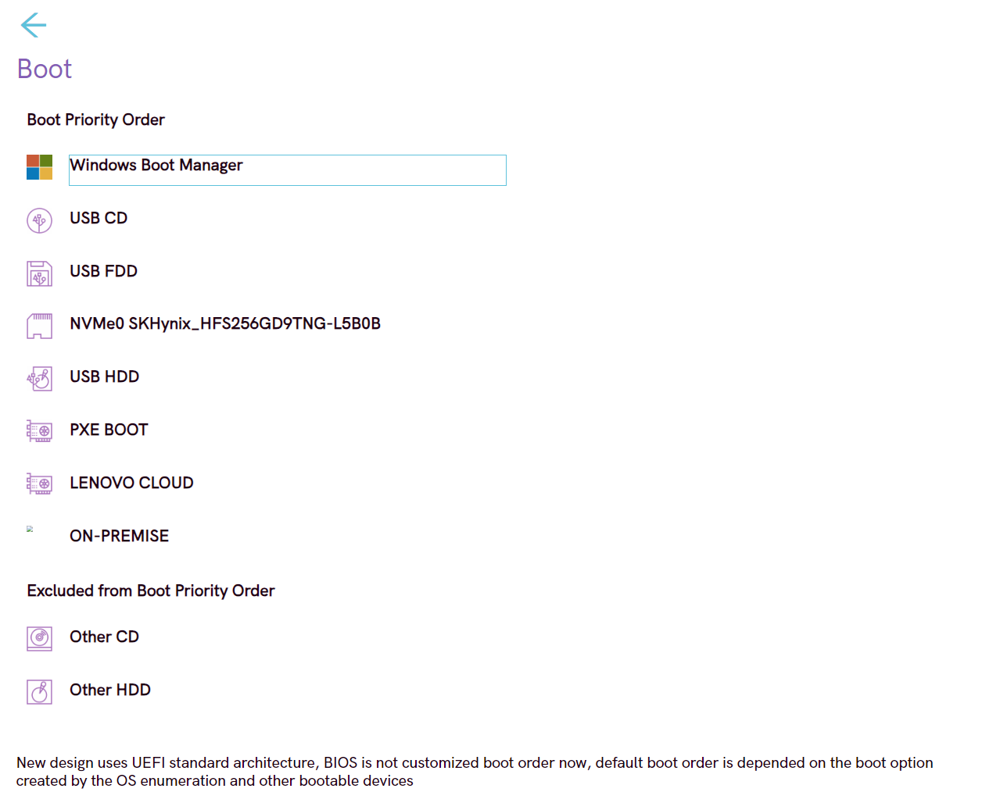

# Startup #

### General ###

Network Boot

Select top priority of the Boot Priority Order when waking from LAN.

Possible options:

1.	**PXE BOOT** – Default
2.	USB CD
3.	USB FDD
4.	NVMe0
5.	USB HDD
6.	LENOVO CLOUD
7.	ON-PREMISE
8.	Other CD
9.	Other HDD

!> `LENOVO CLOUD` and `ON-PREMISE` may not be available on all models.

| WMI Setting name | Values | Locked by SVP | AMD/Intel |
|:---|:---|:---|:---|
| NetworkBoot | HDD0, HDD1, HDD2, HDD3, HDD4,  PXEBOOT, ATAPICD0, ATAPICD1, ATAPICD2, USBFDD,  USBCD, USBHDD, OtherHDD, OtherCD, NVMe0,  NVMe1, HTTPSBOOT, LENOVOCLOUD, ON-PREMISE, NODEV | Yes | Both |

Boot Mode

When to display the diagnostic splash screen.

Possible options:

1.	**Quick** – only when the user presses `Esc` during boot. Default.
2.	Diagnostics – always displays during boot.

| WMI Setting name | Values | Locked by SVP | AMD/Intel |
|:---|:---|:---|:---|
| BootMode | Quick, Diagnostics | No | Both |

Option key Display

Whether system will show the option key message when the system is booted.

Possible options:

1.	**On** – Default.
2.	Off

| WMI Setting name | Values | Locked by SVP | AMD/Intel |
|:---|:---|:---|:---|
| StartupOptionKeys | Disable, Enable | Yes | Both |

Boot device List F12 Option

Whether F12 key is used to invoke a pop-up Boot device list.

Possible options:

1.	**On** – Default.
2.	Off

?>  This option is only available when Supervisor enters setup.

| WMI Setting name | Values | Locked by SVP | AMD/Intel |
|:---|:---|:---|:---|
| BootDeviceListF12Option | Disable, Enable | Yes | Both |

Boot Order Lock

Prevent other software from altering the Boot Order when it is enabled.

?> May be required in situations where an alternative boot loaded is required to be first in the boot order. 

!> When enabled, the Boot Order can only be changed using the BIOS Setup or the WMI interface.

Possible options:

1.	On
2.	**Off** – Default.

| WMI Setting name | Values | Locked by SVP | AMD/Intel |
|:---|:---|:---|:---|
| BootOrderLock | Disable, Enable | Yes | Both |

### Boot ###

Boot Priority Order

The ordered list of currently defined boot priority order.

?> Keys used to view or configure devices:   - '↑' and '↓' arrows Select a device.   - '+' and '-' move the device up or down.   - 'Shift + 1' enables or disables a device.   - 'Delete' deletes an unprotected device.

Possible items on the list:

1.	Windows Boot Manager
2.	USB CD
3.	USB FDD
4.	NVMe0
5.	USB HDD
6.	PXE Boot – sub-menu appears only when multiple network stacks are available. 
    a.	Intel (R) Gigabit x.x.xx-Ipv4 
    b.	Intel (R) Gigabit x.x.xx-Ipv6 
7.	LENOVO CLOUD
8.	ON-PREMISE

!> `LENOVO CLOUD` and `ON-PREMISE` may not be available on all models.

| WMI Setting name | Values | Locked by SVP | AMD/Intel |
|:---|:---|:---|:---|
| BootOrder | HDD0, HDD1, HDD2, HDD3, HDD4,  PXEBOOT, ATAPICD0, ATAPICD1, ATAPICD2, USBFDD,  USBCD, USBHDD, OtherHDD, OtherCD, NVMe0, NVMe1, HTTPSBOOT, LENOVOCLOUD, ON-PREMISE, NODEV | Yes | Both |

Excluded from boot priority order

By default, the following items are excluded from boot priority order:

1.	Other CD
2.	Other HDD

