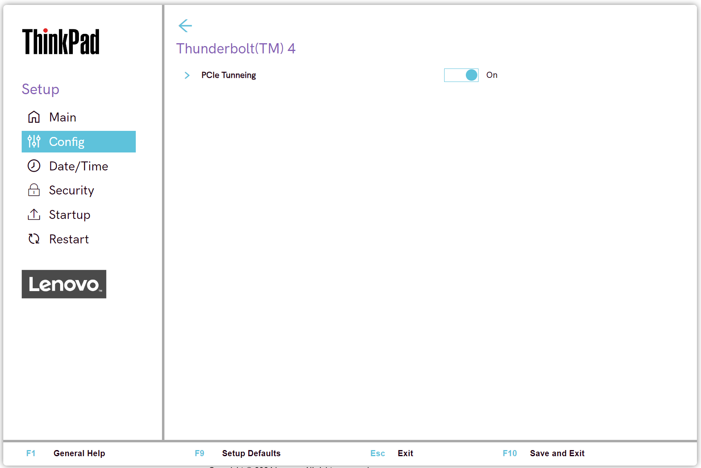

# Thunderbolt(TM) 4 Settings #

PCIe Tunneling

Whether to enable PCIe (peripheral component interconnect express) Tunneling.

Possible states:

1.	**On** - Default.
2.	Off

!>  Some Thunderbolt devices, such as external GPUs and storage drives, may not work properly.

?> The USB functions of USB4 based devices that are Thunderbolt 4 certified may still work.

| WMI Setting name | Values | Locked by SVP | AMD/Intel |
|:---|:---|:---|:---|
| PCIeTunneling | Disable, Enable | Yes | Both |

