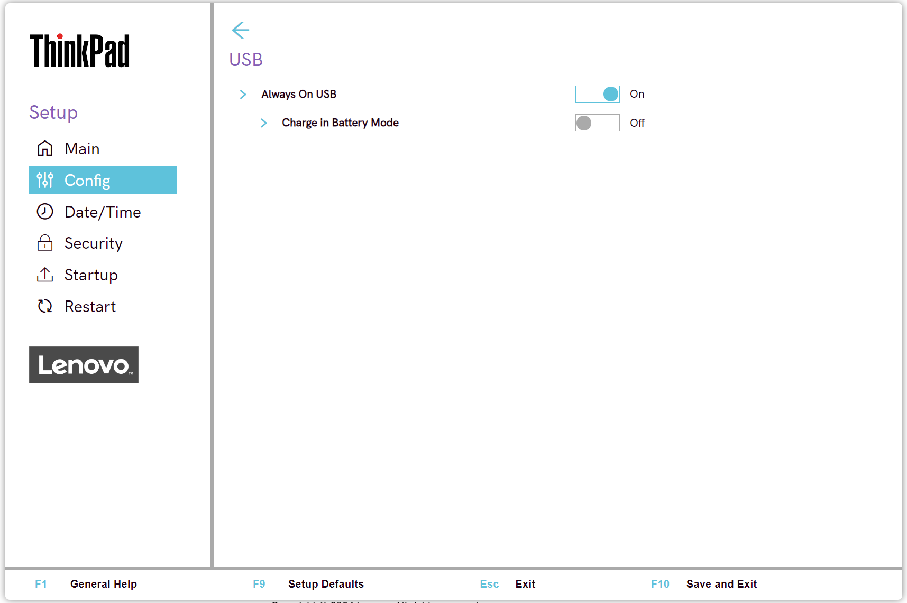

# USB Settings #

Always on USB

Whether the USB ports can charge external device during low power states (standby, hibernate or power-off).

!!! info ""
    If the system runs on battery mode, this works only in standby mode.

Possible options:

1.	**On** - the USB ports are powered during low power states. Default.
2.	Off - USB ports are disabled during low power states.

| WMI Setting name | Values | Locked by SVP | AMD/Intel |
|:---|:---|:---|:---|
| AlwaysOnUSB | Disable, Enable | No | Both |

Charge in Battery Mode

Whether to enable charging when system is in hibernate or power-off state and in battery mode.

!!! info ""
    Visible only if 'Always on USB' is Enabled.

Possible options:

1.	On
2.	**Off** - Default.

| WMI Setting name | Values | Locked by SVP | AMD/Intel |
|:---|:---|:---|:---|
| ChargeInBatteryMode | Disable, Enable | No | Both |

