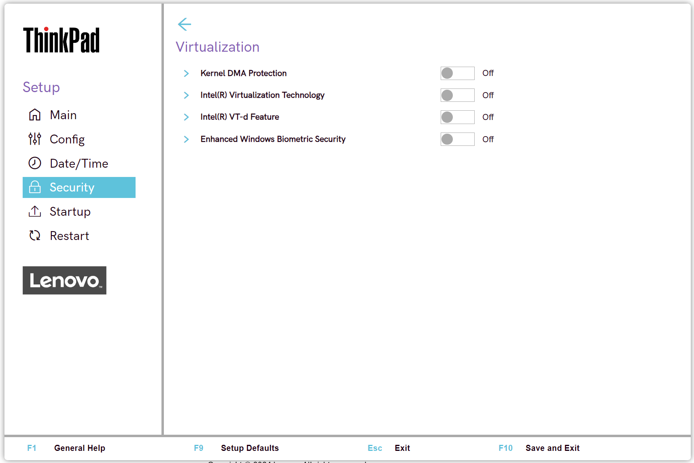

# Virtualization Settings #

Kernel DMA Protection

Whether to enable Kernel DMA protection, to prevent drive-by Direct Memory Access (DMA) attacks using PCI hot plug devices connected to system.

!> Defaults to `On`, if `OS Optimized Defaults` has value `On`.

!> When switched `On`, automatically enables Intel (R) Virtualization Technology and Intel (R) VT-d Feature.

Possible options:

1.	**Off** – Default.
2.	On

?> Requires additional confirmation of changing these settings.

| WMI Setting name | Values | Locked by SVP | AMD/Intel |
|:---|:---|:---|:---|
| KernelDMAProtection | Disable, Enable | Yes | Both |

Intel (R) Virtualization Technology \ AMD-V

### Intel-based machine

Whether a VMM (Virtual Machine Monitor) can utilize the additional hardware capabilities provided by Intel (R) Virtualization technology.

Defaults to `On`, if `OS Optimized Defaults` has value `On`. 

Possible options:

1.	On – 
2.	**Off** - Default.

?>  It is automatically enabled and cannot be disabled if ‘Kernel DMA Protection’ is enabled.

Additional information: [How to enable Virtualization Technology on Lenovo PC computers](https://support.lenovo.com/de/en/solutions/ht500006).

| WMI Setting name | Values | Locked by SVP | AMD/Intel |
|:---|:---|:---|:---|
| VirtualizationTechnology | Disable, Enable | Yes | Intel |

### AMD-based machine

Whether VMM (Virtual Machine Monitor) can utilize the additional hardware capabilities provided by AMD-V (AMD Virtualization).

Possible options:

1. **On** - Default.
2. Off

?>  Enabled automatically when `Device Guard` is set to `On`.

| WMI Setting name | Values | Locked by SVP | AMD/Intel |
|:---|:---|:---|:---|
| AmdVt | Disable, Enable | Yes | AMD |

Intel (R) VT-d Feature

Whether to enable Intel (R) VT-d Feature ( Intel (R) Virtualization Technology for Directed I/O).

!> Defaults to `On`, if `OS Optimized Defaults` has value `On`.

Possible options:

1.	On
2.	**Off** - Default

?>  Automatically enabled and cannot be disabled if `Kernel DMA Protection` is enabled.

More information on the [official Intel site](https://software.intel.com/content/www/us/en/develop/articles/intel-virtualization-technology-for-directed-io-vt-d-enhancing-intel-platforms-for-efficient-virtualization-of-io-devices.html).

| WMI Setting name | Values | Locked by SVP | AMD/Intel |
|:---|:---|:---|:---|
| VTdFeature | Disable, Enable | Yes | Intel |

Enhanced Windows Biometric Security

Whether to allow use of ‘Enhanced sign-in security’ for fingerprint and face authentication with Windows Hello.

Possible options:

1.	On
2.	**Off** – Default.

!>  This option should only be enabled for Windows 10 version 2004 and later. Prior versions of the OS do not support this feature.

| WMI Setting name | Values | Locked by SVP | AMD/Intel |
|:---|:---|:---|:---|
| EnhancedWindowsBiometricSecurity | Disable, Enable | Yes | Both |

