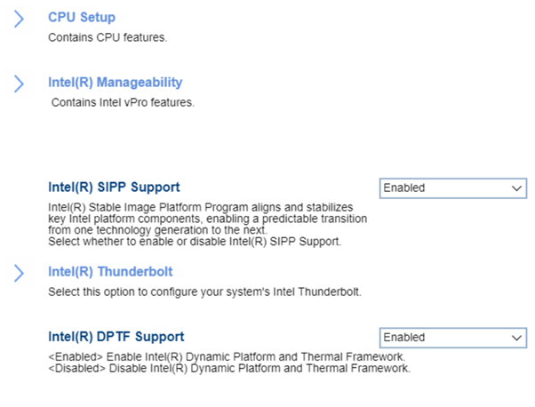
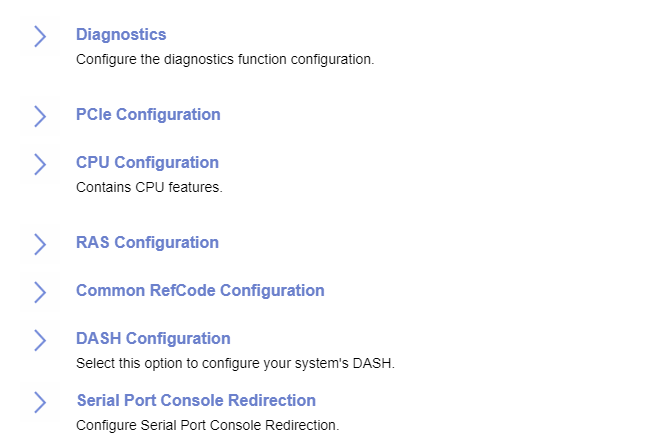

# Advanced #

Advanced - Intel version

<!-- 

-->

WHEA Support

Enable or Disable Windows Hardware Error Architechture.

Options:

1. **Enabled** – Default.
2. Disabled.

| WMI Setting name | Values | SVP / SMP Req'd | AMD/Intel |
|:---|:---|:---|:---|
| WHEASupport | Disabled, Enabled | Yes | Intel |

Intel(R) Total Memory Encryption

Intel(R) Total Memory Encryption(TME) is a technology
that encrypts data written to system memory to
protect DRAM data from physical attacks.

Options:

1. **Disabled** – Default.
2. Enabled.

| WMI Setting name | Values | SVP / SMP Req'd | AMD/Intel |
|:---|:---|:---|:---|
| IntelTotalMemoryEncryption | Disabled, Enabled | yes | Intel |

Intel(R) SIPP Support

!!! info ""
    Intel(R) Stable Image Platform Program (SIPP) aligns and stabilizes key Intel platform components, enabling a predictable transition from one technology generation to the next.

Options:

1. **Enabled** – Default.
2. Disabled.

| WMI Setting name | Values | SVP / SMP Req'd | AMD/Intel |
|:---|:---|:---|:---|
| IntelSIPPSupport | Disabled, Enabled | yes | Intel |

Intel(R) Thunderbolt

Options:

1. **Disabled** – Default.
2. Enabled. 

| WMI Setting name | Values | SVP / SMP Req'd | AMD/Intel |
|:---|:---|:---|:---|
| IntelThunderboltTechnology | Enabled, Disabled | yes | Intel |

Dust Shield Alert

!!! info ""
   If the Dust Shield is not cleaned then it will lose its
effectiveness and the machine may overheat.

Options:

1. **Disabled** – Default. The user is not reminded to clean the Dust Shield.
2. Enabled - The user is reminded to clean the Dust Shield.

| WMI Setting name | Values | SVP / SMP Req'd | AMD/Intel |
|:---|:---|:---|:---|
| DustShieldAlert | Disabled, Enabled | yes | Intel |

Intel(R) DPTF Support

!!! info ""
    Intel(R) Dynamic Platform and Thermal Framework (DPTF) assists with managing power to the CPU vs temperature, keeping CPU temperature down while still delivering good performance.

Options:

1. **Enabled** – Default.
2. Disabled.

!!! info ""
    This feature is optional, so may not be available on all models.

| WMI Setting name | Values | SVP / SMP Req'd | AMD/Intel |
|:---|:---|:---|:---|
| IntelDPTFSupport | Disabled, Enabled | yes | Intel |

Advanced - AMD version

<!---->

<!-- !!! info ""
    Please see sidebar for Advnaced AMD Settings
TODO: confirm layout because each setting is a seperate page in the sidebar Maybe put a statement there -->

