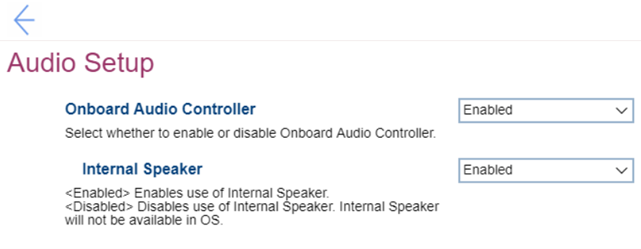

# Audio Setup Settings #

### Intel version ###

<!---->

Onboard Audio Controller

Enable or disable onboard audio controller.

Options:

1. **Enabled**. Default. 
2. Disabled.

!!! info ""
    If set to `Disabled`, the `Internal Speaker` setting will be unavailable.

| WMI Setting name | Values | SVP / SMP Req'd | AMD/Intel |
|:---|:---|:---|:---|
| OnboardAudioController | Disabled, Enabled | yes | Intel |

Internal Speaker

Whether the internal speaker is available in the OS.

Options:

1. **Enabled** - Default. 
2. Disabled 

!!! info ""
    Unavailable if `Onboarding Audio Controller` is set to `Disabled`.

| WMI Setting name | Values | SVP / SMP Req'd | AMD/Intel |
|:---|:---|:---|:---|
| InternalSpeaker | Disabled, Enabled | yes | both |

### AMD version ###

Front Audio Controller

Whether to enable Front Audio Controller.

!!! info ""
    Setting to disabled also disables all front USB ports (both 2.0 and 3.0) and Rear Audio Controller.

Options:

1.  **Enabled** - Default.
2.  Disabled.

| WMI Setting name | Values | SVP or SMP Req'd | AMD/Intel |
|:---|:---|:---|:---|
| FrontAudioController | Enabled, Disabled | yes | AMD |

Rear Audio Controller

Whether to enable Rear Audio Controller.

Options:

1.  **Enabled** - Default.
2.  Disabled.

| WMI Setting name | Values | SVP or SMP Req'd | AMD/Intel |
|:---|:---|:---|:---|
| RearAudioController | Disable, Enable | yes | AMD |

