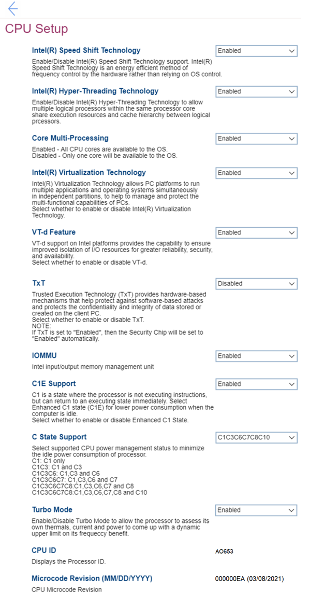

# CPU Setup - Intel (R) #

<!--
I think these are amd> 

-->

Intel(R) Speed Shift Technology

Intel(R) Speed Shift Technology is an energy efficient method of frequency control by the hardware rather than relying on OS control.

Options:

1. **Enabled** – Default. 
2. Disabled – Intel(R) Speed Shift Technology is turned off. 

| WMI Setting name | Values | SVP / SMP Req'd | AMD/Intel |
|:---|:---|:---|:---|
| SpeedShiftTechnology | Disabled, Enabled | yes | Intel |

Intel(R) Hyper-Threading Technology

Intel(R) Hyper-Threading Technology allows multiple logical processors, within the same processor core, to share execution resources and cache hierarchy between logical processors. 

Options:

1. **Enabled** – Default. 
2. Disabled. 

!!! info ""
    If `TxT` is set to `Enabled`, then this item will always be `Enabled`. 

| WMI Setting name | Values | SVP / SMP Req'd | AMD/Intel |
|:---|:---|:---|:---|
| HyperThreadingTechnology | Disabled, Enabled | yes | Intel |

Core Multi-Processing

How many cores are available to the OS.

Options:

1. **Enabled** – All CPU cores. Default. 
2. Disabled – Only one core.

!!! info ""
    If `TxT` is set to `Enabled`, then this item will always be `Enabled`.

| WMI Setting name | Values | SVP / SMP Req'd | AMD/Intel |
|:---|:---|:---|:---|
| CoreMultiProcessing | Enabled, Disabled | yes | Intel |

Efficient-Cores

Options:

1. **Enabled** – All CPU cores. Default. 
2. Disabled – Only one core.

| WMI Setting name | Values | SVP / SMP Req'd | AMD/Intel |
|:---|:---|:---|:---|
| EfficientCores | Enabled, Disabled | yes | Intel |

Intel(R) Virtualization Technology

Intel(R) Virtualization Technology allows PC platforms to run multiple applications and operating systems simultaneously in independent partitions, to help to manage and protect the multi-functional capabilities of PCs.

Options:

1. **Enabled** – Default.
2. Disabled.

!!! info ""
    When Intel(R) Virtualization Technology is turned off and the following are set to `Disabled` and cannot be changed:   a. VT-d Feature   b. TxT

Additional information is available here: [How to enable Virtualization Technology on Lenovo PC computers](https://support.lenovo.com/de/en/solutions/ht500006).

| WMI Setting name | Values | SVP / SMP Req'd | AMD/Intel |
|:---|:---|:---|:---|
| VirtualizationTechnology | Disabled, Enabled | yes | Intel |

VT-d Feature

!!! info ""
    VT-d support on Intel platforms provides the capability to ensure improved isolation of I/O resources for greater reliability, security, and availability.

Options:

1. **Enabled** – Default.
2. Disabled.

Additional information is available here: [VT-d Feature](https://www.intel.com/content/www/us/en/search.html?ws=text#q=VT-d%20Feature&sort=relevancy&f:@tabfilter=[Developers]).

| WMI Setting name | Values | SVP / SMP Req'd | AMD/Intel |
|:---|:---|:---|:---|
| VTdFeature | Disabled, Enabled | yes | Intel |

TxT

!!! info ""
    Trusted Execution Technology (TxT) provides hardware-based mechanisms that help protect against software-based attacks and protects the confidentiality and integrity of all data stored or created on the client PC.

Options:

1. Enabled
2. **Disabled** - Default.

!!! info ""
    If TxT is set to `Enabled`, then the `Security Chip` setting will be set to `Enabled` automatically.

Additional information is available here: [Intel(R) TXT Overview](https://www.intel.com/content/www/us/en/support/articles/000025873/technologies.html).

| WMI Setting name | Values | SVP / SMP Req'd | AMD/Intel |
|:---|:---|:---|:---|
| TXTFeature | Disabled, Enabled | yes | Intel |

IOMMU

!!! info ""
    Intel Input/Output Memory Management Unit (IOMMU) is a hardware component that performs address translation from I/O device virtual addresses to physical addresses. This hardware-assisted I/O address translation improves the system performance within a virtual environment.

Options:

1. Enabled.
2. **Disabled** – Default.

| WMI Setting name | Values | SVP / SMP Req'd | AMD/Intel |
|:---|:---|:---|:---|
| IOMMU | Disabled, Enabled | yes | Intel |

C1E Support

C1 is a state where the processor is not executing instructions, but can return to an executing state immediately. 

Enhanced C1 state (C1E) provides lower power consumption when the computer is idle.  

Options:

1. **Enabled** – Default. 
2. Disabled.

| WMI Setting name | Values | SVP / SMP Req'd | AMD/Intel |
|:---|:---|:---|:---|
| C1ESupport | Disabled, Enabled | yes | Intel |

C State Support

Supported CPU power management status to minimize the idle power consumption of processor.

Options:

1. C1 – C1 only.
2. C1C3 – C1 and C3.
3. C1C3C6 – C1, C3 and C6.
4. C1C3C6C7C8 – C1, C3, C6, C7 and C8.
5. **C1C3C6C7C8C10** – C1, C3, C6, C7, C8 and C10. Default.

| WMI Setting name | Values | SVP / SMP Req'd | AMD/Intel |
|:---|:---|:---|:---|
| CStateSupport | C1, C1C3, C1C3C6, C1C3C6C7, C1C3C6C7C8, C1C3C6C7C8C10 | yes | Intel |

Turbo Mode

!!! info ""
    Turbo Mode allows the processor to assess its own thermals, current and power to come up with a dynamic upper limit on its frequency benefit.

Options:

1. **Enabled** –  Default. 
2. Disabled. 

| WMI Setting name | Values | SVP / SMP Req'd | AMD/Intel |
|:---|:---|:---|:---|
| TurboMode | Disabled, Enabled | yes | Intel |

### CPU ID ###

Displays the Processor ID.

View only.

### Microcode Revision ( MM/DD/YYYY ) ###

Displays the CPU Microcode Revision date.

View only.