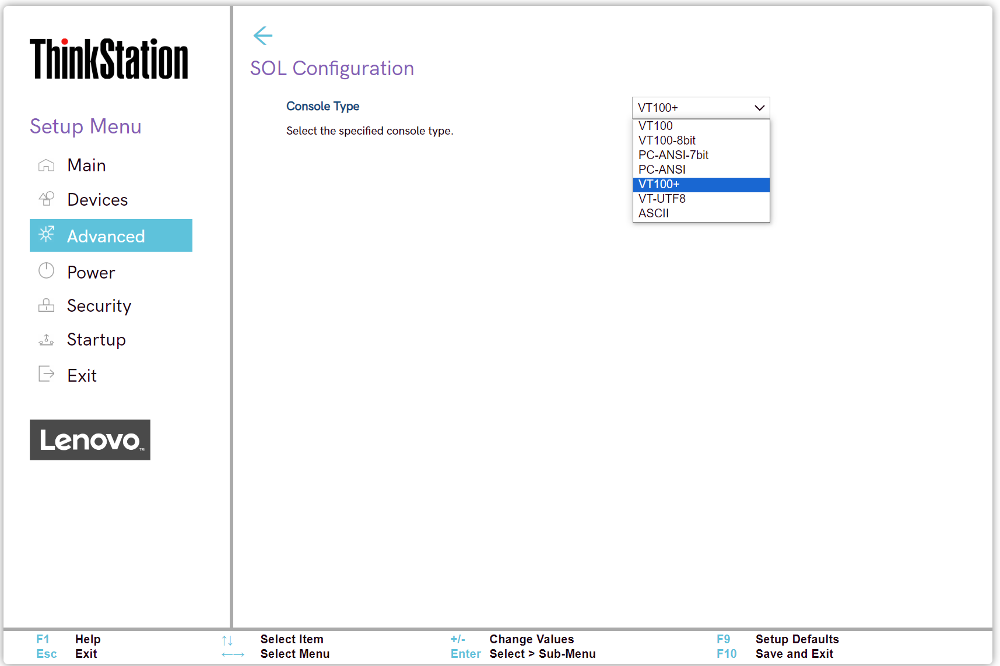

# Intel(R) Manageability Settings #

Intel(R) Manageability

Options:

1. **Enabled** – Default.
2. Disabled.

!!! info ""
    When `Disabled`:     a. If system is provisioned, MEBx (Management Engine BIOS Extension) will be unprovisioned first.     b. Manageability functions will be disabled. You can enter BIOS to re-enable Intel(R) Manageability. 

!!! info ""
    When changing from `Enabled` to `Disabled`, after saving and exiting SETUP, you need to unplug the AC power cord and plug it in again.

| WMI Setting name | Values | SVP / SMP Req'd | AMD/Intel |
|:---|:---|:---|:---|
| ManageabilityControl | Disabled, Enabled | yes | Intel |

Intel(R) Manageability Reset

Options:

1. Enabled.
2. **Disabled** – Default.

!!! info ""
    When `Enabled`, Intel(R) Manageability settings will reset to default configuration.  The MEBx password will also be reset. 

Press < Ctrl-P > to Enter MEBx

!!! info ""
    Management Engine BIOS Extension (MEBx) provides platform-level configuration options for you to configure the behavior of Management Engine (ME) platform.

Options:

1. **Enabled** – Default.
2. Disabled.

| WMI Setting name | Values | SVP / SMP Req'd | AMD/Intel |
|:---|:---|:---|:---|
| CtrlPEnterMEBx | Disabled, Enabled | yes | Intel |

### ME Firmware Version ###

Management Engine (ME) Firmware version. View only.

!!! info ""
    Intel(R) based models only.

### Manageability Type ###

Manageability Type. View only.

Options:

1. None
2. Intel(R) AMT
3. Intel(R) Standard Manageability
4. Intel(R) Level III Manageability Upgrade

### SOL Configuration ###

SOL (Serial over LAN) configuration group of settings. 

Console Type

Options:

1. VT100
2. VT100-8bit
3. PC-ANSI-7bit
4. PC-ANSI
5. **VT100+** – Default.
6. VT-UTF8
7. ASCII

| WMI Setting name | Values | SVP / SMP Req'd | AMD/Intel |
|:---|:---|:---|:---|
| SOLConfiguration | VT100, VT100-8bit, PC-ANSI-7bit, PC-ANSI, VT100+, VT-UTF8, ASCII | yes | Intel |

USB Provisioning 

Options:

1. Enabled.
2. **Disabled** - Default.

| WMI Setting name | Values | SVP / SMP Req'd | AMD/Intel |
|:---|:---|:---|:---|
| USBProvisioning | Disabled, Enabled | yes | Intel |

