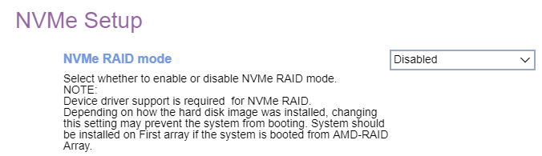

# NVMe Setup #

<!---->

NVMe RAID Mode

Whether to enable NVMe RAID mode.

!> Device driver support is required  for NVMe RAID.     Depending how the hard disk image was installed, changing this setting may prevent the system from booting.

Options:

1.  **Disabled** - Default.
2.  Enabled.

| WMI Setting name | Values | SVP or SMP Req'd | AMD/Intel |
|:---|:---|:---|:---|
| NVMeRAIDMode | Disable, Enable | ACL | AMD |

<!-- TODO: clarify ACL -->

