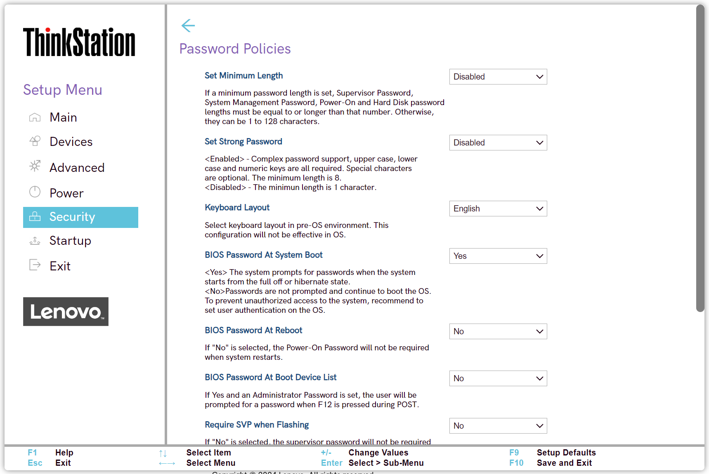

# Password Policies Settings #

Set Minimum Length

Options:

1. **Disabled** – passwords can have 1 to 128 characters. Default. 
2. 4 Characters
3. 5 Characters
4. 6 Characters
5. 7 Characters
6. 8 Characters
7. 9 Characters
8. 10 Characters
9. 11 Characters
10. 12 Characters

?> A minimum length set here applies to   - Supervisor Password (SVP)   - System Management Password (SMP)   - Power-On Password (PoP)   - Hard Disk Password (HDP).

| WMI Setting name | Values | SVP / SMP Req'd | AMD/Intel |
|:---|:---|:---|:---|
| SetMinimumLength | Disable, 4 Characters, 5 Characters, 6 Characters, 7 Characters, 8 Characters, 9 Characters, 10 Characters, 11 Characters, 12 Characters | yes | Both |

Set Strong Password

?> A strong password is defined as:   - Upper case, lower case, and numeric characters are all required   -  Special characters are optional   - The minimum length is 8

Options:

1. Enabled.
2. **Disabled** – the minimum length is 1 character. Default.

| WMI Setting name | Values | SVP / SMP Req'd | AMD/Intel |
|:---|:---|:---|:---|
| SetStrongPassword | Disabled, Enabled | yes | Both |

Keyboard Layout

Keyboard layout for password.

Options:

1. **English** – Default.
2. French
3. German
4. Chinese

| WMI Setting name | Values | SVP / SMP Req'd | AMD/Intel |
|:---|:---|:---|:---|
| KeyboardLayout | English, French, German, Chinese | yes | Both |

BIOS Password At System Boot

Whether to prompt for passwords when the system starts from the full off or hibernate state.

Options:

1. **Yes** –  Default.
2. No.

!> To prevent unauthorized access to the system we recommend to setting user authentication on the OS. 

| WMI Setting name | Values | SVP / SMP Req'd | AMD/Intel |
|:---|:---|:---|:---|
| BIOSPasswordAtSystemBoot | No, Yes | yes | Both |

BIOS Password At Reboot

Whether to require Power-On Password when system restarts.

Options:

1. Yes.
2. **No** - Default.

| WMI Setting name | Values | SVP / SMP Req'd | AMD/Intel |
|:---|:---|:---|:---|
| BIOSPasswordAtReboot | No, Yes | yes | Both |

BIOS Password At Boot Device List

Whether user is prompted for a password when F12 is pressed during POST (Power On Self Test).

!> Password prompt requires that Administrator Password is set.

Options:

1. Yes.
2. **No** – Default.

| WMI Setting name | Values | SVP / SMP Req'd | AMD/Intel |
|:---|:---|:---|:---|
| BIOSPasswordAtBootDeviceList | No, Yes | yes | Both |

Require SVP when Flashing

Whether the Supervisor Password (SVP) is required when updating the system software.

Options:

1. Yes.
2. **No** – Default.

| WMI Setting name | Values | SVP / SMP Req'd | AMD/Intel |
|:---|:---|:---|:---|
| RequireSVPwhenFlashing | No, Yes | yes | Both |

POP Changeable by User

Whether the Power-On Password (POP) can be changed without Supervisor Password (SVP).

Options:

1. **Yes** –  Default.
2. No – the Power-On Password can only be changed with the SVP.

| WMI Setting name | Values | SVP / SMP Req'd | AMD/Intel |
|:---|:---|:---|:---|
| POPChangeablebyUser | No, Yes | yes | Both |

Allow Jumper Clear SVP

Whether to allow the hardware jumper to clear the Supervisor Password.

!> No action can reset the SVP if user forgets it.

Options:

1. **Yes** – Default.
2. No.

| WMI Setting name | Values | SVP / SMP Req'd | AMD/Intel |
|:---|:---|:---|:---|
| AllowJumperClearSVP | No, Yes | yes | Both |

Password Count Exceeded Error

Whether to show the POST 0199 error and prompt for password after three failed attempts.

Options:

1. **Enabled** – Default.
2. Disabled.

?> If `Enabled`, then after 3 attempts with an incorrect password, the system will show a 0199 error.   - User can  bypass the error by pressing F2.    -  0199 error is still shown.   -  Clear the error condition by pressing F10, or saving the settings after this has been verified, by entering bios with correct SVP.   - If a user attempts to change BIOS settings and uses the wrong password, the system will deny access.   - After a third failed attempt, all other attempts will fail. No further changes can be made, and user needs to reboot.

| WMI Setting name | Values | SVP / SMP Req'd | AMD/Intel |
|:---|:---|:---|:---|
| PasswordCountExceededError | Disabled, Enabled | yes | Both |

