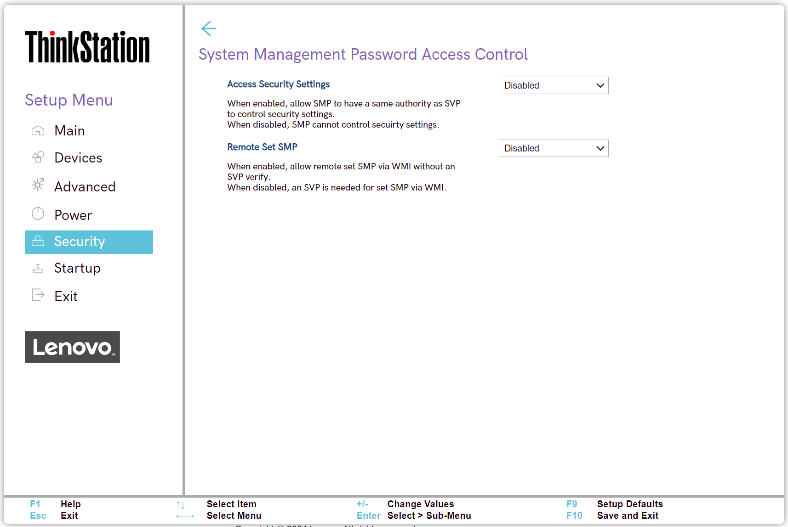

# System Management Password Access Control Settings #

Access Security Settings

Whether to allow SMP (System Management Password) to have the same authority as SVP (Supervisor Password) to control security settings.

Options:

1. **Disabled** – Default. 
2. Enabled.

| WMI Setting name | Values | SVP / SMP Req'd | AMD/Intel |
|:---|:---|:---|:---|
| AccessSecuritySettings | Disabled, Enabled | yes | Both |

Remote Set SMP

Whether an SVP (Supervisor Password) is needed to set SMP (System Management Password) via WMI (Windows Management Instrumentation).

Options:

1. **Disabled** – Default.
2. Enabled.

| WMI Setting name | Values | SVP / SMP Req'd | AMD/Intel |
|:---|:---|:---|:---|
| RemoteSetSMP | Disabled, Enabled | yes | Both |

