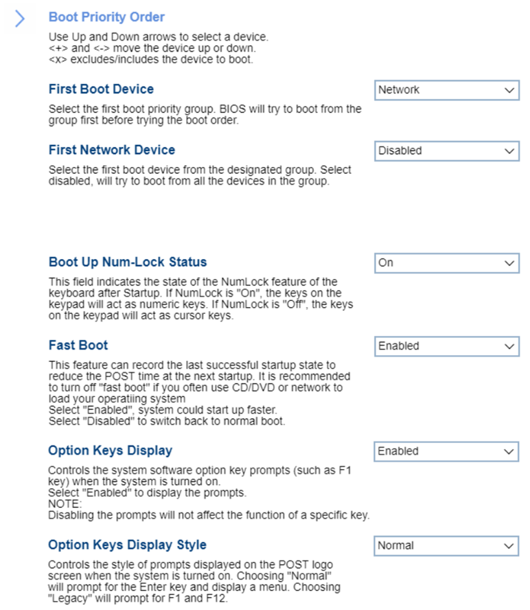

# Startup #

<!---->

First Boot Device

BIOS will try to boot from the group first before trying the boot order.

Options:

1. **Boot Order** – Default. 
2. Network
3. SATA Drive
4. M.2 Drive
5. PCIE Drive
6. USB HDD
7. USB CDROM

| WMI Setting name | Values | SVP / SMP Req'd | AMD/Intel |
|:---|:---|:---|:---|
| FirstBootDevice | Boot Order, NetWork, SATA Drive, M.2 Drive, PCIe Drive, USB HDD, USB CDROM | yes | Intel |

First {Drive Type} Device

Select the first boot device from the designated group:

{Drive Type} means one of:
 - Network
 - SATA
 - M.2
 - PCIE.

1. **Disabled** – system will try to boot from all the devices in the group. Default.
2. Other options will show the relevant list of devices in the group depending on the selected item in 'First Boot Device': 'Network', 'SATA Drive', 'M.2 Drive' or 'PCIE'.

USB Boot Support

Options:

1. **Enabled** – Default. The system could support boot from USB devices.
2. Disabled - The system could not support boot from USB devices.

| WMI Setting name | Values | SVP / SMP Req'd | AMD/Intel |
|:---|:---|:---|:---|
| USBBootSupport | Enabled, Disabled | yes | Both |

Boot Up Num-Lock Status

Whether keys on the keypad will act as numeric keys.

Options:

1. **On** – numeric keys. Default. 
2. Off – cursor keys.

| WMI Setting name | Values | SVP / SMP Req'd | AMD/Intel |
|:---|:---|:---|:---|
| BootUpNumLockStatus | Off, On | yes | Both |

Fast Boot

 Whether to record the last successful startup state to reduce the POST time at the next startup.

!!! info ""
    We recommend turning off “Fast Boot” if you often use CD/DVD or network to load your operating system.

Options:

1. **Enabled** – Default. 
2. Disabled.

| WMI Setting name | Values | SVP / SMP Req'd | AMD/Intel |
|:---|:---|:---|:---|
| FastBoot | Disabled, Enabled | yes | Intel |

Option Keys Display

Whether to display option key prompts (such as F1 key) when the system is turned on. 

Options:

1. Enabled. 
2. **Disabled** - Default.

!!! info ""
    Disabling the prompts will not affect the function of a specific key.

| WMI Setting name | Values | SVP / SMP Req'd | AMD/Intel |
|:---|:---|:---|:---|
| OptionKeysDisplay | Disabled, Enabled | yes | Both |

Option Keys Display Style

!!! info ""
    Visible only if `Option Keys Display` is `Enabled` state.

Which prompts to display on the POST logo screen when the system is turned on.

Options:

1. **Normal** – prompt for the Enter key and display a menu. Default.
2. Legacy – prompt for F1 and F12.

<!-- | WMI Setting name | Values | SVP / SMP Req'd | AMD/Intel |
|:---|:---|:---|:---|
| OptionKeysDisplayStyle | Normal, Legacy | yes | Both | -->

Primary Boot Sequence

!!! info ""
    This sequence is used when the system is powered up normally.

Use Up and Down arrows to select a device.

`+` and `-` move the device up or down.

`x` excludes / includes the device from the boot sequence.

| WMI Setting name | Values | SVP or SMP Req'd | AMD/Intel |
|:---|:---|:---|:---|
| PrimaryBootSequence | M.2 Drive | Yes | Both | 

Automatic Boot Sequence

!!! info ""
    This sequence is used when a communication device wakes the system up.

Use Up and Down arrows to select a device.

`+` and `-` move the device up or down.

`x` excludes / includes the device from the boot sequence.

| WMI Setting name | Values | SVP or SMP Req'd | AMD/Intel |
|:---|:---|:---|:---|
| AutomaticBootSequence | M.2 Drive | Yes | Both |

Error Boot Sequence

!!! info ""
    This sequence is used when BIOS determines that an error has occurred.

Use Up and Down arrows to select a device.

`+` and `-` move the device up or down.

`x` excludes / includes the device from the boot sequence.

| WMI Setting name | Values | SVP or SMP Req'd | AMD/Intel |
|:---|:---|:---|:---|
| ErrorBootSequence | M.2 Drive | Yes | Both | 

Manufacturing Boot Sequence

Use Up and Down arrows to select a device.

`+` and `-` move the device up or down.

`x` excludes / includes the device from the boot sequence.
<!-- 
| WMI Setting name | Values | SVP or SMP Req'd | AMD/Intel |
|:---|:---|:---|:---|
| setting_name | setting_values | yes_no | both | -->

